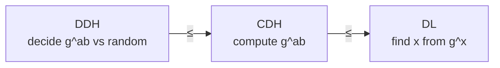
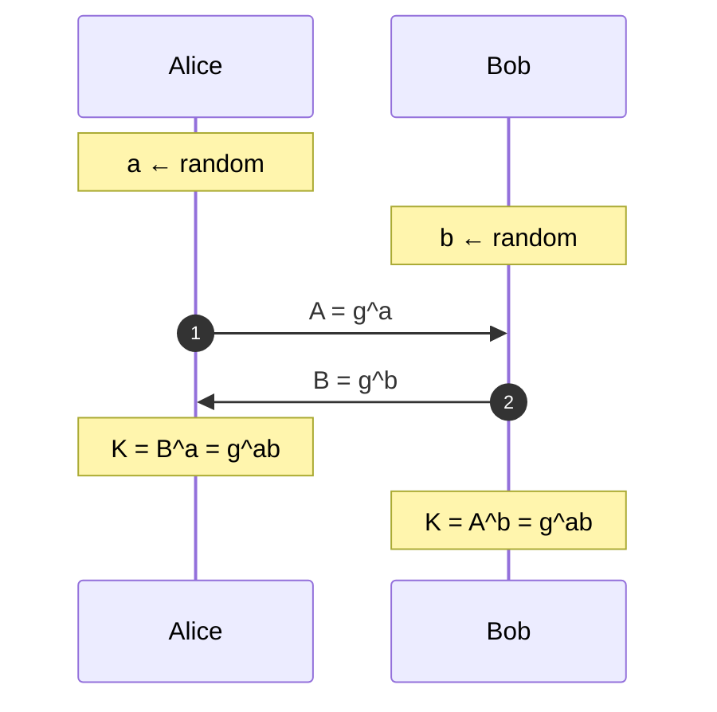

# Discrete Logarithm

## The Assumption

Let $G = \langle g \rangle$ be a finite cyclic group of prime order $n$ with generator $g$. For $h \in G$, the **discrete logarithm** of $h$ base $g$ is the unique $x \in [0, n)$ such that $g^x = h$. The _discrete log problem_ (DLP) is to compute $x$ given $(g, h)$.

The assumption that DLP is hard depends heavily on the group:

| Group                                               | DLP hardness                                  |
| --------------------------------------------------- | --------------------------------------------- |
| $(\mathbb{Z}/n\mathbb{Z},\, +)$ (additive)          | **Easy** — $x = h / g \bmod n$ with XGCD      |
| $(\mathbb{Z}/p\mathbb{Z})^{\ast}$ (mult. mod prime) | Sub-exponential (index calculus)              |
| $\mathbb{F}_{p^k}^{\ast}$ (extension field)         | Sub-exponential, sometimes quasi-polynomial   |
| Elliptic curve $E(\mathbb{F}_p)$ (well-chosen)      | Exponential $O(\sqrt{n})$ — no index calculus |
| General black-box group                             | Exponential — $\sqrt{n}$ lower bound (Shoup)  |

## Variants

All three are defined relative to the same group $G = \langle g \rangle$ of order $n$.

**DL (Discrete Log):** given $(g,\, g^x)$, find $x$.

**CDH (Computational Diffie-Hellman):** given $(g,\, g^a,\, g^b)$, compute $g^{ab}$.

**DDH (Decisional Diffie-Hellman):** given $(g,\, g^a,\, g^b,\, Z)$, decide whether $Z = g^{ab}$ or $Z$ is random.

Hardness hierarchy (easier → harder):

Solving DL solves CDH; solving CDH solves DDH. Reductions in the other direction are unknown in general.

> **DDH can be easy while CDH is hard.** In groups with an efficient pairing $e: G \times G \to G_T$ (like BLS12-381), DDH is _broken_ — test whether $e(g^a, g^b) = e(g, Z)$ — yet CDH is still believed hard. Such groups are called **gap-DH groups** and are the foundation of pairing-based crypto.

## Diffie-Hellman Key Exchange

Both derive $K = g^{ab}$. Security rests on **CDH** — the adversary sees $g^a, g^b$ and must compute $g^{ab}$.

Authenticated variants (station-to-station, signed DH, TLS) add signatures to defeat active MITM.

## ElGamal Encryption

Public key $h = g^x$, private key $x$. To encrypt $m \in G$:

$$
r \;\leftarrow\; [0, n) \qquad c_1 = g^r \qquad c_2 = m \cdot h^r
$$

Decrypt:

$$
m = \frac{c_2}{c_1^x} = \frac{m \cdot g^{rx}}{g^{xr}}
$$

ElGamal is **semantically secure** under **DDH** — distinguishing $(g^a,\, g^b,\, g^{ab})$ from random is exactly what an attacker needs to distinguish ciphertexts of two chosen plaintexts.

It is **multiplicatively homomorphic**: $\operatorname{Enc}(m_1) \cdot \operatorname{Enc}(m_2) = \operatorname{Enc}(m_1 \cdot m_2)$ component-wise. Exponential ElGamal (encrypt $g^m$ instead of $m$) becomes additively homomorphic, used in e-voting.

## Attacks on DL / DH / ElGamal

### Generic (work in any group)

| Attack                          | Cost                                                                                                                                                                                     |
| ------------------------------- | ---------------------------------------------------------------------------------------------------------------------------------------------------------------------------------------- |
| **Brute force**                 | $O(n)$                                                                                                                                                                                   |
| **Baby-step Giant-step (BSGS)** | $O(\sqrt{n})$ time, $O(\sqrt{n})$ memory — meet in the middle                                                                                                                            |
| **Pollard's rho (for logs)**    | $O(\sqrt{n})$ time, $O(1)$ memory                                                                                                                                                        |
| **Pollard's kangaroo / lambda** | $O(\sqrt{b - a})$ when $x$ is known to lie in $[a, b]$                                                                                                                                   |
| **Pohlig-Hellman**              | If $n = \prod p_i^{e_i}$, reduces DLP to DLPs in subgroups of prime order $p_i$. Total cost $O\!\left(\sum \sqrt{p_i}\right)$ — so **always use a group of prime (or near-prime) order** |
| **Shor's algorithm**            | Polynomial on a quantum computer                                                                                                                                                         |

### Specific to $(\mathbb{Z}/p\mathbb{Z})^{\ast}$ and extension fields

| Attack                         | Notes                                                                                                                                      |
| ------------------------------ | ------------------------------------------------------------------------------------------------------------------------------------------ |
| **Index calculus**             | Sub-exponential $L_p[1/2,\, \dots]$ — factors random powers over a smooth factor base, solves a linear system                              |
| **Number Field Sieve for DL**  | Best known for prime fields, $L_p\!\left[1/3,\, (64/9)^{1/3}\right]$ — same asymptotic as GNFS for factoring                               |
| **Function Field Sieve / FFS** | Even faster (quasi-polynomial) for small-characteristic fields like $\mathbb{F}_{2^n}$ — these are **broken for crypto use**               |
| **Logjam**                     | Precompute the heavy first stage of NFS against _one_ commonly-used 512-bit or 1024-bit DH prime, then break thousands of sessions cheaply |

### Active / protocol-level

| Attack                             | Notes                                                                                                                                                                                                                               |
| ---------------------------------- | ----------------------------------------------------------------------------------------------------------------------------------------------------------------------------------------------------------------------------------- |
| **MITM on unauthenticated DH**     | Classic — attacker runs two DH exchanges, one with each party. Fix with authentication                                                                                                                                              |
| **Small-subgroup attack**          | If the server doesn't check that the peer's point lies in the prime-order subgroup, an attacker sends an element of small-order subgroup and the shared secret lives in that tiny subgroup — leaking bits of the static private key |
| **Invalid-curve attack** (on ECDH) | Send a point on a _different_ curve with weak order. The server's scalar multiplication still "works" and reveals the key mod the weak order. Fix: validate the point                                                               |
| **Raccoon attack**                 | Timing side channel on DH premasters with leading zero bytes in TLS                                                                                                                                                                 |

## Elliptic Curves

Define an elliptic curve over $\mathbb{F}_p$ by

$$
y^2 = x^3 + a x + b
$$

The points (plus a point at infinity) form an abelian group under the chord-and-tangent rule. Scalar multiplication $[k]P = \underbrace{P + P + \cdots + P}_{k \text{ times}}$ is the analog of exponentiation; the hard problem is **ECDLP**: given $(P,\, [k]P)$, find $k$.

**Why ECC is preferred:**

- **No index calculus.** The best known attacks on general elliptic curve groups are the generic $O(\sqrt{n})$ algorithms.
- **Smaller keys.** Roughly: ECC-256 ≈ RSA-3072 ≈ DH-3072 in security level.
- **Faster operations** for equivalent security.

**Weak curve classes to avoid:**

- **Supersingular curves** — the **MOV attack** uses the Weil pairing to embed ECDLP into DLP over $\mathbb{F}_{p^k}$ for small $k$, where index calculus applies.
- **Anomalous curves** ($\#E(\mathbb{F}_p) = p$) — **Smart's attack** / Semaev / Satoh-Araki solves ECDLP in linear time via the formal group / $p$-adic logarithm.
- **Curves over small-characteristic fields with composite extension degrees** — **Weil descent / GHS attack**.
- **Low-embedding-degree curves** — vulnerable to MOV-style pairing attacks (but _intentionally_ used in pairing-based crypto).

**Curves in common use:**

| Curve                      | Field                                        | Used in                     |
| -------------------------- | -------------------------------------------- | --------------------------- |
| secp256k1                  | $\mathbb{F}_p,\; p = 2^{256} - 2^{32} - 977$ | Bitcoin, Ethereum           |
| Curve25519 / Ed25519       | $\mathbb{F}_{2^{255} - 19}$                  | SSH, TLS 1.3, Signal        |
| NIST P-256 / P-384 / P-521 | Prime field                                  | TLS, JWT, smartcards        |
| BLS12-381                  | Pairing-friendly                             | Ethereum 2.0, Zcash Sapling |
| BN254                      | Pairing-friendly                             | older zkSNARKs              |

> For pairing-friendly curves, DDH is easy (gap group) but CDH and bilinear-CDH remain hard — this is exactly what BLS signatures and identity-based encryption exploit.
