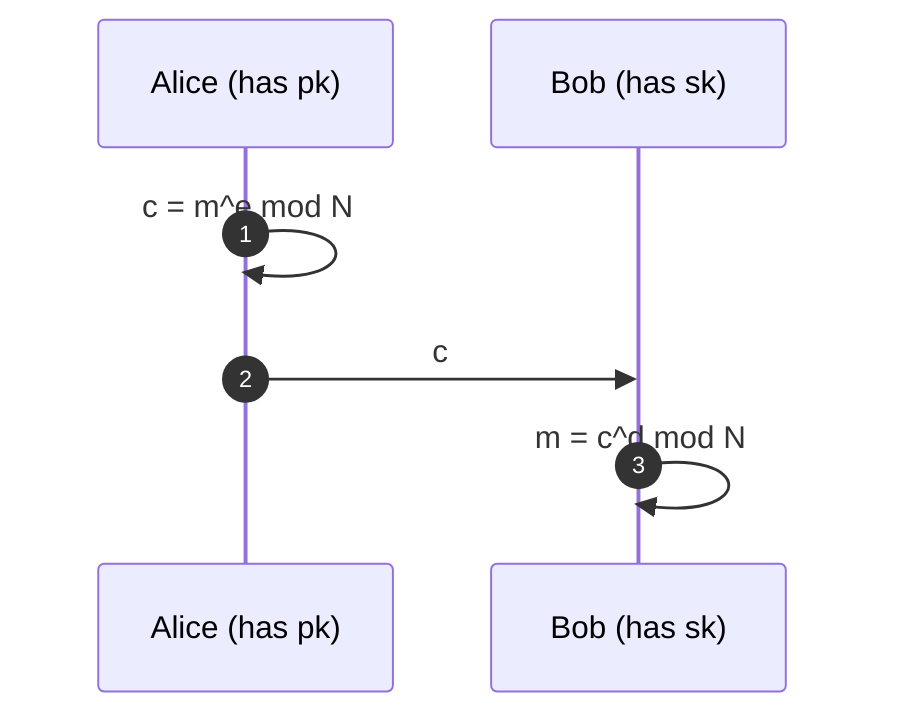

# Factoring Assumption

## The Assumption

Given a composite integer $N = p \cdot q$ where $p, q$ are large primes of comparable size, it is **computationally infeasible** to recover $p$ and $q$ from $N$. This is the _integer factorization problem_.

The assumption has no proof — it is a belief grounded in decades of unsuccessful attempts. The best known classical algorithm (GNFS) is sub-exponential but not polynomial, and Shor's algorithm breaks it in polynomial time _on a quantum computer_, so post-quantum schemes avoid it.

A related problem is **RSA inversion** (a.k.a. the RSA assumption): given $(N, e, c)$ with $c = m^e \bmod N$, recover $m$. Factoring $N$ trivially breaks RSA, but whether RSA inversion is _as hard as_ factoring is still an open problem. The **Rabin cryptosystem** is stronger in this sense: breaking it is _provably equivalent_ to factoring.

## RSA

Key generation:

$$
\begin{aligned}
p, q      &\;\leftarrow\; \text{large random primes} \\
N         &= p \cdot q \\
\varphi(N) &= (p - 1)(q - 1)      &&\text{(Euler's totient)} \\
e         &\;\leftarrow\; \text{small public exponent with } \gcd(e, \varphi(N)) = 1 \\
d         &\equiv e^{-1} \pmod{\varphi(N)}   &&\text{(via extended GCD)}
\end{aligned}
$$

- **Public key:** $(N, e)$
- **Private key:** $d$ (or equivalently $(p, q)$)

Encryption / decryption:

$$
c = m^e \bmod N \qquad\qquad m = c^d \bmod N
$$

Correctness follows from Euler's theorem:

$$
m^{e \cdot d} \;=\; m^{1 + k \cdot \varphi(N)} \;\equiv\; m \pmod{N}
$$

**Signing** works in reverse ($s = m^d \bmod N$, verify $s^e \equiv m \pmod{N}$), but textbook RSA signatures are insecure — always use a padding scheme (PSS, PKCS#1 v1.5).

## Rabin

Rabin replaces the exponent $e$ with $2$:

$$
c = m^2 \bmod N \qquad\qquad m = \sqrt{c} \bmod N
$$

Computing square roots mod $N = pq$ requires knowing $p, q$ (use CRT to combine the roots mod $p$ and mod $q$). This is **provably equivalent to factoring**: an algorithm that extracts arbitrary square roots mod $N$ can be turned into a factoring algorithm.

> **Decryption ambiguity:** $c$ has _four_ square roots mod $N$. The decrypter must add redundancy (structured padding, a hash, repeated bits) to pick the right one.

## Attacks on Factoring-Based Schemes

### On the factoring problem itself

| Attack                                | Cost / When it applies                                                                                                             |
| ------------------------------------- | ---------------------------------------------------------------------------------------------------------------------------------- |
| Trial division                        | $O(\sqrt{N})$ — only useful for tiny $N$                                                                                           |
| Fermat's factorization                | Fast when $p, q$ are close together (write $N = a^2 - b^2$)                                                                        |
| Pollard's rho                         | $O(N^{1/4})$ expected — good for small factors                                                                                     |
| Pollard's $p-1$                       | Fast if $p - 1$ is **B-smooth** (all prime factors $\le B$)                                                                        |
| Williams' $p+1$                       | Dual of $p-1$, uses Lucas sequences                                                                                                |
| ECM (Elliptic Curve Method)           | Sub-exponential in the _size of the smallest factor_                                                                               |
| Quadratic Sieve (QS)                  | Best for $N$ up to ~100 digits                                                                                                     |
| **GNFS** (General Number Field Sieve) | Best known classical: $\displaystyle \exp\!\left(\bigl((\tfrac{64}{9})^{1/3} + o(1)\bigr)\,(\ln N)^{1/3} (\ln \ln N)^{2/3}\right)$ |
| **Shor's algorithm**                  | Polynomial time on a quantum computer                                                                                              |

Key-generation countermeasures: $p$ and $q$ must be of similar but not too-close size, and $p-1,\; q-1,\; p+1,\; q+1$ must each have a large prime factor (_safe primes_) to defeat Pollard-family attacks.

### RSA-specific attacks (assume factoring is still hard)

| Attack                           | Condition                                                                                                 |
| -------------------------------- | --------------------------------------------------------------------------------------------------------- |
| **Wiener's attack**              | Small private exponent, $d < N^{1/4} / 3$ — recovers $d$ from continued fractions of $e/N$                |
| **Boneh-Durfee**                 | Extension of Wiener up to $d < N^{0.292}$ via lattice methods                                             |
| **Håstad's broadcast**           | Same $m$ encrypted to $e$ recipients with small $e$ and no randomized padding — CRT + $e$-th root         |
| **Franklin-Reiter**              | Related messages $m_1, m_2 = f(m_1)$ encrypted under the same key                                         |
| **Coppersmith**                  | Small $e$ + partial knowledge of $m$ — find small roots of $f(x) \equiv 0 \pmod{N}$ with LLL              |
| **Common modulus**               | Same $N$ used with two keys $e_1, e_2$ with $\gcd(e_1, e_2) = 1$ — recover $m$ without either private key |
| **Low public exponent**          | If $m^e < N$, no modular reduction happens — just take the integer $e$-th root                            |
| **Bleichenbacher (1998)**        | Padding-oracle attack on PKCS#1 v1.5 — use server's "valid/invalid padding" response as an oracle         |
| **Manger's attack**              | Padding-oracle on OAEP when implementations leak timing on the leading-byte check                         |
| **Fault-injection on CRT**       | If signing via CRT and one half is faulted, $\gcd(s^e - m,\; N)$ reveals a factor (Bellcore attack)       |
| **Timing / cache side channels** | Leak bits of $d$ during modular exponentiation — mitigate with blinding and constant-time code            |

### Rabin-specific

Rabin is vulnerable to a **chosen-ciphertext attack**: an attacker who can submit ciphertexts to a decryption oracle learns square roots, and two distinct square roots of the same $c$ give a non-trivial factor of $N$ via $\gcd(x - y,\; N)$. This is why Rabin is rarely deployed without strong padding (Rabin-SAEP, etc.).
