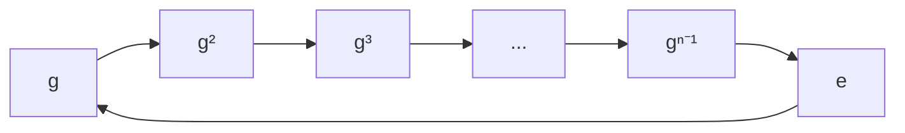
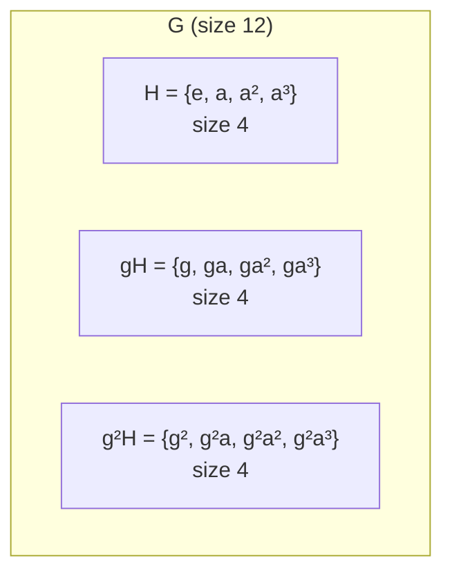

# Group Theory

Every public-key primitive in this section — RSA, Diffie-Hellman, ElGamal, ECDSA, Schnorr, BLS — lives inside a **finite group**. This chapter collects the algebraic scaffolding. The cryptographic payoff only makes sense once the structure is clear.

## Groups

A **group** $(G,\, \cdot)$ is a set $G$ with a binary operation $\cdot : G \times G \to G$ satisfying:

1. **Associativity:** $(a \cdot b) \cdot c = a \cdot (b \cdot c)$
2. **Identity:** there exists $e \in G$ with $e \cdot a = a \cdot e = a$ for all $a$
3. **Inverses:** for every $a$ there exists $a^{-1}$ with $a \cdot a^{-1} = e$

If additionally $a \cdot b = b \cdot a$ for all $a, b$, the group is **abelian** (a.k.a. commutative). Every group that appears in classical crypto is abelian; pairings on $G_1 \times G_2$ look non-commutative only because the two inputs live in different groups.

The **order** of a group is $|G|$ — its number of elements. The order of an element $a$ is the smallest $k \ge 1$ with $a^k = e$ (write $\operatorname{ord}(a) = k$, or $\infty$ if no such $k$).

### Examples you'll meet

| Group                              | Operation            | Identity      | Size                      |
| ---------------------------------- | -------------------- | ------------- | ------------------------- |
| $(\mathbb{Z}/n\mathbb{Z},\; +)$    | addition mod $n$     | $0$           | $n$                       |
| $(\mathbb{Z}/n\mathbb{Z})^{\ast}$  | mult. mod $n$        | $1$           | $\varphi(n)$              |
| $(\mathbb{F}_p,\; +)$              | field addition       | $0$           | $p$                       |
| $(\mathbb{F}_p^{\ast},\; \cdot)$   | field multiplication | $1$           | $p - 1$                   |
| $E(\mathbb{F}_p)$ (elliptic curve) | chord-and-tangent    | $\mathcal{O}$ | $\approx p$ (Hasse bound) |

## Subgroups

$H \subseteq G$ is a **subgroup** if it is itself a group under the same operation. Concretely: $H$ is non-empty, closed under $\cdot$, and closed under inverses.

The trivial subgroups are $\{e\}$ and $G$ itself. The interesting ones are in between.

**Lagrange's theorem** is the single most useful fact about finite groups:

$$
H \le G \;\implies\; |H| \text{ divides } |G|
$$

Corollary: every element's order divides $|G|$, so

$$
a^{|G|} = e \quad\text{for all } a \in G.
$$

When $G = (\mathbb{F}_p^{\ast},\, \cdot)$ with $|G| = p - 1$, this _is_ Fermat's little theorem. When $G = (\mathbb{Z}/n\mathbb{Z})^{\ast}$, this _is_ Euler's theorem. One inequality, two theorems.

> **Cryptographic takeaway.** Lagrange is why we want groups of **prime order**: if $|G| = n$ is prime, the only subgroups are $\{e\}$ and $G$. No hidden small subgroup = no Pohlig-Hellman shortcut on the discrete log.

## Cyclic Groups and Generators

A group is **cyclic** if a single element generates everything: there exists $g \in G$ with $G = \{e,\, g,\, g^2,\, \ldots,\, g^{n-1}\}$. Such a $g$ is called a **generator** (or _primitive root_ when $G = (\mathbb{F}_p^{\ast})$).

Every element of a cyclic group of order $n$ can be written uniquely as $g^k$ for $k \in [0, n)$. This gives the isomorphism

$$
(\mathbb{Z}/n\mathbb{Z},\; +) \;\cong\; \bigl(\langle g \rangle,\; \cdot\bigr)
$$

via $k \mapsto g^k$. Inverting this map is the **discrete log problem** — easy in the additive copy (just XGCD), conjecturally hard in the multiplicative copy for well-chosen groups.

### Facts about a cyclic group of order $n$

1. For each divisor $d$ of $n$, there is exactly **one** subgroup of order $d$, and it is cyclic: $\langle g^{n/d} \rangle$.
2. $g^k$ generates the whole group iff $\gcd(k, n) = 1$, so there are **$\varphi(n)$ generators** total.
3. Two elements $g^a$ and $g^b$ are equal iff $a \equiv b \pmod{n}$ — exponents live mod $n$, not mod anything smaller.

### When is $(\mathbb{Z}/n\mathbb{Z})^{\ast}$ cyclic?

**Not always.** It's cyclic exactly when $n \in \{1,\, 2,\, 4,\, p^k,\, 2p^k\}$ for odd prime $p$. Crucially:

- $(\mathbb{F}_p^{\ast},\; \cdot)$ is **always cyclic** for prime $p$ — so we can always find a primitive root mod $p$.
- $(\mathbb{Z}/pq\mathbb{Z})^{\ast}$ (RSA's group) is **not cyclic** — it decomposes as $(\mathbb{Z}/p\mathbb{Z})^{\ast} \times (\mathbb{Z}/q\mathbb{Z})^{\ast}$ by CRT (Chinese Remainder Theorem).

### Finding a generator

Given $|G| = n$ with known prime factorization $n = \prod p_i^{e_i}$, an element $g$ is a generator iff

$$
g^{n / p_i} \neq e \quad\text{for every prime } p_i \mid n.
$$

You don't have to check $g^d \neq e$ for _every_ proper divisor $d$ — only the maximal ones. Pick random elements and test; a $\varphi(n) / n$ fraction of the group are generators, so a few tries suffice.

## Cosets

For a subgroup $H \le G$ and an element $g \in G$, the **left coset** is

$$
gH \;=\; \{\, g \cdot h \;:\; h \in H \,\}.
$$

Right cosets $Hg$ are defined symmetrically. In an abelian group they coincide, and we just write "coset."

### Key facts

1. Two cosets are either **identical or disjoint** — cosets partition $G$.
2. Every coset has the same size as $H$: $|gH| = |H|$.
3. The number of cosets (the **index** $[G : H]$) satisfies $[G : H] = |G| / |H|$ — this is the one-line proof of Lagrange.

Cosets are the right way to think about "working modulo a subgroup." When we write $a \equiv b \pmod{n}$, the underlying statement is "$a$ and $b$ are in the same coset of $n\mathbb{Z}$ inside $\mathbb{Z}$." The residue classes mod $n$ _are_ the cosets.

### Quotient groups (brief)

When $H$ is **normal** (automatic in abelian groups), the set of cosets itself forms a group under $(gH) \cdot (g'H) = (g g')H$. We write it $G / H$, the **quotient group**. Its size is $[G : H]$.

Example: $\mathbb{Z} / n\mathbb{Z}$ literally means "integers modulo the subgroup $n\mathbb{Z}$" — the notation _is_ the construction. Same idea gives $(\mathbb{Z}/p\mathbb{Z})^{\ast} / \{\pm 1\}$, the group where quadratic residues and non-residues get identified (useful for analyzing the Jacobi symbol).

## Chinese Remainder Theorem

For coprime moduli $m, n$ (i.e. $\gcd(m, n) = 1$), there is a ring isomorphism

$$
\mathbb{Z}/mn\mathbb{Z} \;\cong\; \mathbb{Z}/m\mathbb{Z} \times \mathbb{Z}/n\mathbb{Z}, \qquad x \mapsto (x \bmod m,\; x \bmod n)
$$

The map is a bijection — any pair of residues $(a, b)$ pins down a unique $x \bmod mn$ — and it respects both $+$ and $\cdot$. So every computation mod $mn$ splits into two independent computations mod $m$ and mod $n$ that you can run side-by-side and reassemble at the end.

Extended to $k$ pairwise-coprime moduli $n_1, \ldots, n_k$ with $n = \prod_i n_i$:

$$
\mathbb{Z}/n\mathbb{Z} \;\cong\; \prod_{i=1}^{k} \mathbb{Z}/n_i\mathbb{Z}
$$

Restricting to units gives the corresponding multiplicative-group decomposition:

$$
(\mathbb{Z}/mn\mathbb{Z})^{\ast} \;\cong\; (\mathbb{Z}/m\mathbb{Z})^{\ast} \times (\mathbb{Z}/n\mathbb{Z})^{\ast}
$$

which is why $\varphi$ is multiplicative on coprime arguments ($\varphi(mn) = \varphi(m)\,\varphi(n)$), and why $(\mathbb{Z}/pq\mathbb{Z})^{\ast}$ — RSA's group — is a product of two smaller cyclic groups rather than a single cyclic group.

### Constructive form

Given $a \equiv x \pmod{m}$ and $b \equiv x \pmod{n}$ with $\gcd(m, n) = 1$, reconstruct $x \bmod mn$ as

$$
x \;\equiv\; a \cdot n \cdot (n^{-1} \bmod m) \;+\; b \cdot m \cdot (m^{-1} \bmod n) \pmod{mn}
$$

The modular inverses come from XGCD (see [Modular Inverse](../math/arithmetic.md#modular-inverse)). Once precomputed, each reconstruction is $O(1)$ multiplications — which is what makes the splitting a genuine speedup rather than just a conceptual trick.

### Why crypto cares

CRT is one of the quietest but most load-bearing tools in this section:

- **RSA-CRT decryption / signing (~$4\times$ speedup).** With the private $(p, q)$, compute $c^d \bmod p$ and $c^d \bmod q$ on half-sized moduli and recombine. Since schoolbook modular exponentiation is cubic in bit-length, the total cost drops from $\sim L^3$ to $\sim L^3 / 4$. A single bit-flip during one of the two half-computations also enables the classic **RSA-CRT fault attack** — a $\gcd$ on the faulty signature leaks a factor of $N$.
- **Pohlig-Hellman reduction.** If $|G| = n = \prod p_i^{e_i}$, CRT on exponents decomposes a discrete log in $G$ into independent DLs in each subgroup of order $p_i^{e_i}$. Total cost becomes $O\!\bigl(\sum_i e_i \sqrt{p_i}\bigr)$ — devastating if any $p_i$ is small. **This is the reason cryptographic groups insist on prime (or near-prime) order:** composite orders leak their prime-factor structure, and CRT is the exact statement of that leak.
- **Secret sharing via residues.** Mignotte's and Asmuth-Bloom's constructions use pairwise-coprime moduli $n_1 < n_2 < \cdots$: the secret $s$ lives in a range above the product of any $k - 1$ moduli but below the product of any $k$, and shares are $s \bmod n_i$. Any $k$ shareholders reconstruct $s$ via CRT; fewer than $k$ leave $s$ uniformly ambiguous in a large window.

Running theme: composite-order structures fracture along their prime factorization. Designs either **avoid** composite orders (modern elliptic curves use prime-order subgroups) or **weaponize** the decomposition for speed (RSA-CRT).

## Finite Fields

A **field** $(\mathbb{F},\, +,\, \cdot)$ is a set with two operations where:

- $(\mathbb{F},\, +)$ is an abelian group (identity $0$)
- $(\mathbb{F} \setminus \{0\},\, \cdot)$ is an abelian group (identity $1$)
- Multiplication distributes over addition

A **finite field** (a.k.a. _Galois field_) has finitely many elements. The central theorem:

> For every prime $p$ and every $k \ge 1$, there is exactly one finite field of size $p^k$ up to isomorphism, written $\mathbb{F}_{p^k}$ or $\operatorname{GF}(p^k)$. There are **no** finite fields of any other size.

The prime $p$ is the **characteristic** — the smallest integer with $\underbrace{1 + 1 + \cdots + 1}_{p} = 0$.

### $\mathbb{F}_p$ — the prime field

Just $\mathbb{Z}/p\mathbb{Z}$ with the obvious operations. Every non-zero element has an inverse (because $\gcd(a, p) = 1$ for $a \not\equiv 0$), so it's a field. This is the ground floor of modular arithmetic.

### $\mathbb{F}_{p^k}$ — extension fields

You cannot build $\mathbb{F}_{p^k}$ as $\mathbb{Z}/p^k\mathbb{Z}$ — that ring isn't a field (e.g. $p$ has no inverse in $\mathbb{Z}/p^2\mathbb{Z}$). Instead, pick an **irreducible polynomial** $f(x) \in \mathbb{F}_p[x]$ of degree $k$ and work in

$$
\mathbb{F}_{p^k} \;=\; \mathbb{F}_p[x] \,\big/\, \bigl(f(x)\bigr).
$$

Elements are polynomials of degree $< k$ with coefficients in $\mathbb{F}_p$; multiplication is polynomial multiplication reduced mod $f(x)$. This is structurally the same as how $\mathbb{C} = \mathbb{R}[x] / (x^2 + 1)$: adjoin a root of something that doesn't factor.

Binary fields $\mathbb{F}_{2^k}$ (used in AES's byte operations, in older pairing-based crypto, in Reed-Solomon coding) are the most common extension fields in practice. They're fast because addition is XOR and multiplication can be done with carryless shifts.

### The multiplicative group of a finite field

The single most important fact for crypto:

> $\mathbb{F}_{q}^{\ast}$ is **cyclic** of order $q - 1$ for every prime power $q$.

So for any finite field, there exists a single element $g$ whose powers run through every non-zero element. This is exactly what lets us pose the discrete log problem over $\mathbb{F}_p^{\ast}$ or $\mathbb{F}_{2^k}^{\ast}$.

Consequence: the equation $x^d = 1$ has at most $d$ solutions in $\mathbb{F}_q^{\ast}$ — because the solutions form a subgroup, and cyclic subgroups of order dividing $d$ are unique and of size $\gcd(d, q - 1)$.

### Squares, cubes, and residues

In $\mathbb{F}_p^{\ast}$ with $p$ odd:

$$
\text{\# quadratic residues} \;=\; \tfrac{p - 1}{2}
$$

because $x \mapsto x^2$ is a 2-to-1 map from $\mathbb{F}_p^{\ast}$ onto its image. More generally, the $d$-th power map has kernel of size $\gcd(d, p - 1)$, so the image has size $(p - 1) / \gcd(d, p - 1)$. This is why RSA works: choosing $\gcd(e,\, \varphi(N)) = 1$ makes $x \mapsto x^e$ a **bijection**, so every ciphertext has a unique plaintext.

**Euler's criterion** (the quickest way to test a quadratic residue):

$$
a^{(p - 1)/2} \equiv
\begin{cases}
\phantom{-}1 & \text{if } a \text{ is a QR mod } p \\
-1 & \text{if } a \text{ is a non-residue}
\end{cases}
\pmod{p}
$$

Rabin's square root decryption and the Tonelli-Shanks algorithm are built on top of this.

## Why This Pays Off in Crypto

Everything in the next three chapters is an application of the structure above. A quick map:

| Primitive                | Underlying group                                                   | Fact it relies on                                              |
| ------------------------ | ------------------------------------------------------------------ | -------------------------------------------------------------- |
| RSA key recovery         | $(\mathbb{Z}/N\mathbb{Z})^{\ast}$                                  | Euler's theorem ($a^{\varphi(N)} = 1$), which is Lagrange      |
| Diffie-Hellman / ElGamal | prime-order subgroup of $\mathbb{F}_p^{\ast}$ or $E(\mathbb{F}_p)$ | Cyclic group → well-defined discrete log                       |
| Schnorr / ECDSA          | prime-order subgroup of $E(\mathbb{F}_p)$                          | Linearity of the group law; hardness of DL in the subgroup     |
| BLS signatures           | bilinear $G_1 \times G_2 \to G_T$                                  | Cyclic groups of equal prime order, with a pairing as a bridge |
| Pohlig-Hellman attack    | subgroup lattice of a composite-order group                        | Lagrange → splits DL into prime-power subgroups                |

Two running themes are worth keeping in mind:

1. **Prime order is a feature, not a coincidence.** It's how we eliminate small subgroups and sidestep Pohlig-Hellman. Every modern curve's group size is prime (or prime times a tiny cofactor).
2. **The discrete log is hard only because the cyclic isomorphism $\mathbb{Z}/n\mathbb{Z} \to \langle g \rangle$ is one-way in the right direction.** Change the representation (e.g. pair into $G_T$) and the problem can collapse.
