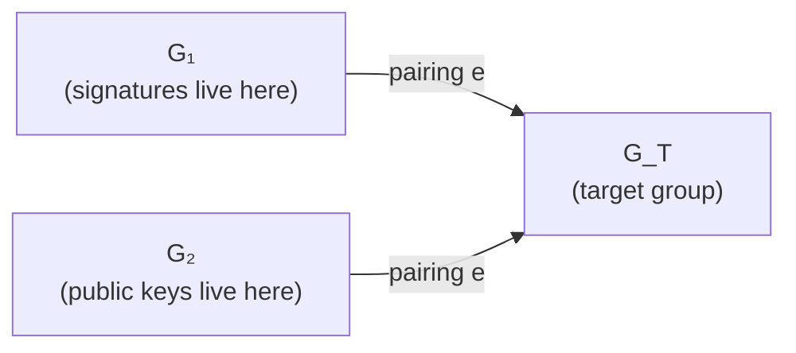

# Signatures

A digital signature scheme is a triple $(\operatorname{KeyGen},\, \operatorname{Sign},\, \operatorname{Verify})$:

- $\operatorname{KeyGen}() \to (sk,\, pk)$
- $\operatorname{Sign}(sk,\, m) \to \sigma$
- $\operatorname{Verify}(pk,\, m,\, \sigma) \to \{\text{true},\, \text{false}\}$

Security goal is **EUF-CMA**: existentially unforgeable under chosen-message attacks — even after seeing signatures on arbitrarily many chosen messages, an adversary cannot produce a valid signature on a _new_ message.

All three schemes below live in an elliptic curve group of prime order $n$ with generator $G$. Private keys are scalars $d \in [1, n)$, public keys are points $Q = [d]G$.

## ECDSA

Sign message $m$ with private key $d$:

$$
\begin{aligned}
k &\;\leftarrow\; [1, n) &&\text{nonce — MUST be fresh and unpredictable}\\
R &= [k]G \\
r &= R.x \bmod n &&\text{if } r = 0,\text{ retry with new } k\\
s &= k^{-1}\bigl(H(m) + r \cdot d\bigr) \bmod n \\
\sigma &= (r,\, s)
\end{aligned}
$$

Verify with public key $Q$:

$$
\begin{aligned}
u_1 &= H(m) \cdot s^{-1} \bmod n \\
u_2 &= r \cdot s^{-1} \bmod n \\
R' &= [u_1]G + [u_2]Q \\
&\text{accept iff } R'.x \bmod n = r
\end{aligned}
$$

### Issues

- **Nonce reuse is catastrophic.** Two signatures $(r, s_1),\, (r, s_2)$ on different messages $m_1 \neq m_2$ with the same $k$ give

  $$
  k = \frac{H(m_1) - H(m_2)}{s_1 - s_2}, \qquad d = \frac{s_1 \cdot k - H(m_1)}{r}
  $$

  This has leaked keys in the Sony PS3 hack (fixed $k$), in Bitcoin wallets with broken RNGs, and in countless Java `SecureRandom` bugs on Android.

- **Biased nonces leak the key** even without full reuse — a few bits of bias over many signatures lets lattice attacks (Howgrave-Graham-Smart, Bleichenbacher's nonce attack) recover $d$.
- **Malleability.** If $(r, s)$ is a valid signature, so is $(r,\, n - s)$. Bitcoin enforces $s \le n/2$ ("low-S rule") to prevent transaction-id malleability.
- **Mitigation:** [**RFC 6979**](https://datatracker.ietf.org/doc/html/rfc6979) derives $k = \operatorname{HMAC}(d,\, H(m))$ deterministically — no RNG needed, no reuse possible.

## Schnorr

Sign message $m$:

$$
\begin{aligned}
k &\;\leftarrow\; [1, n) \\
R &= [k]G \\
e &= H(R \,\|\, Q \,\|\, m) \\
s &= k + e \cdot d \bmod n \\
\sigma &= (R,\, s) \quad\text{or } (e,\, s)
\end{aligned}
$$

Verify:

$$
e = H(R \,\|\, Q \,\|\, m) \qquad \text{accept iff}\; [s]G = R + [e]Q
$$

Correctness:

$$
[s]G = [k + e d]G = [k]G + [e d]G = R + [e]Q
$$

### Why Schnorr is nicer than ECDSA

- **Provable security** in the random oracle model under the DL assumption (via the forking lemma). ECDSA has no analogous reduction.
- **Linearity** enables:
  - **Batch verification** — verify $N$ signatures at cost $\sim N + \log n$ group operations instead of $2N$.
  - **Multi-signatures (MuSig / MuSig2).** A set of signers produces a _single_ Schnorr signature valid under the sum of their public keys.
  - **Threshold signatures (FROST).** $t$-of-$n$ signing without a trusted dealer.
  - **Adaptor signatures / scriptless scripts.** Used for Lightning, atomic swaps, CoinSwap.
- **Non-malleable** (with proper key-prefixing — hashing $Q$ into $e$).
- **Deterministic nonces** standard (BIP 340), same idea as RFC 6979.

Schnorr was patented until 2008, which is why ECDSA won Bitcoin's original design. Taproot activation (2021) added BIP 340 Schnorr to Bitcoin.

## BLS (Boneh-Lynn-Shacham)

BLS uses a **bilinear pairing** $e: G_1 \times G_2 \to G_T$ on a pairing-friendly curve (typically BLS12-381). $e$ is a map with:

- **Bilinearity:** $e\bigl([a]P,\, [b]Q\bigr) = e(P,\, Q)^{ab}$
- **Non-degeneracy:** $e(G_1,\, G_2) \neq 1$
- Efficient computation

Let $H: \{0, 1\}^{\ast} \to G_1$ be a hash-to-curve function.

$$
\text{Sign:} \quad \sigma = [d] \cdot H(m) \in G_1
$$

$$
\text{Verify:} \quad e(\sigma,\, G_2) \;\stackrel{?}{=}\; e\bigl(H(m),\, Q\bigr) \quad\text{where } Q = [d] G_2 \in G_2
$$

Correctness by bilinearity:

$$
e\bigl([d]\,H(m),\, G_2\bigr) \;=\; e\bigl(H(m),\, G_2\bigr)^d \;=\; e\bigl(H(m),\, [d] G_2\bigr)
$$

### Standout properties

- **Deterministic.** Signatures have no nonce, so the RNG failures that plague ECDSA are impossible.
- **Short.** On BLS12-381, signatures are 48 bytes (compressed $G_1$ point) and public keys are 96 bytes.
- **Signature aggregation.** Given $\sigma_i = [d_i]\,H(m_i)$, define

  $$
  \sigma_{\text{agg}} = \sum_i \sigma_i \qquad\text{(sum of points in } G_1 \text{)}
  $$

  Verify with a single multi-pairing:

  $$
  e(\sigma_{\text{agg}},\, G_2) \;=\; \prod_i e\bigl(H(m_i),\, Q_i\bigr)
  $$

  One constant-size signature attests to $N$ independent sign-events. This is why **Ethereum 2.0's consensus layer** uses BLS — one slot can have hundreds of thousands of validator attestations aggregated into a single 48-byte signature. Also used by **Dfinity / Internet Computer** and **Chia**.

- **Rogue-key attack:** a naive aggregation scheme (same $m$ signed by all) lets an attacker pick $Q' = Q_{\text{adv}} - \sum Q_{\text{others}}$ and forge aggregate signatures. Defenses: proof-of-possession on registration, or distinct-message aggregation, or BLS-MuSig style coefficients.

### Cost

BLS signing is a single scalar-multiplication, but **verification requires a pairing** — ~10× slower than ECDSA verify. Aggregation is the payoff: when you verify one aggregate instead of $N$ individuals, BLS wins for large $N$.

## Quick comparison

|                    | ECDSA                           | Schnorr                              | BLS                              |
| ------------------ | ------------------------------- | ------------------------------------ | -------------------------------- |
| Signature size     | ~64 B (2 scalars)               | ~64 B (point + scalar, or 2 scalars) | 48 B (one $G_1$ point)           |
| Hardness           | ECDLP                           | ECDLP                                | co-CDH + pairing                 |
| Nonce required     | yes (fragile)                   | yes (can be deterministic)           | no                               |
| Deterministic sig  | only with RFC 6979              | BIP 340 standard                     | always                           |
| Batch verification | awkward                         | native                               | native (aggregation)             |
| Aggregation        | no                              | multi-sig via MuSig                  | full non-interactive aggregation |
| Verify speed       | fast                            | fast                                 | slow (pairing)                   |
| Quantum-safe       | no                              | no                                   | no                               |
| Real-world use     | TLS, X.509, Bitcoin pre-Taproot | Bitcoin Taproot, Signal X3DH-ish     | Ethereum 2.0, Chia, Dfinity      |
