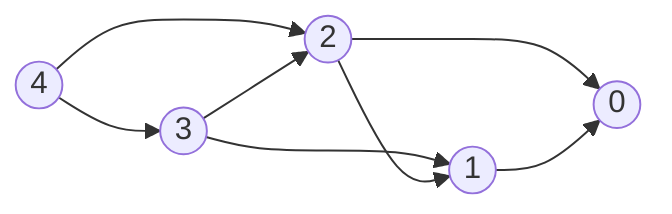

# Dynamic Programming

**Dynamic programming (DP)** solves a problem by expressing its answer in terms of answers to smaller instances of the same shape, then caching those answers so each is computed once. Two ingredients are required:

- **Optimal substructure** — the global optimum decomposes into optima of subproblems.
- **Overlapping subproblems** — the same subproblem is encountered along many decomposition paths. Without overlap, plain recursion (or divide-and-conquer) is enough; the cache buys nothing.

If a problem has only the first, you don't need DP. If it has both, DP turns exponential recursion into polynomial table-fill.

The chapter is split by the **shape of the state space**:

- [**1D DP**](./dp-1d.md) — state indexed by one integer (a position in a sequence). Climbing stairs, house robber, Kadane's, LIS, coin change, jump game.
- [**2D DP**](./dp-2d.md) — two indices: two sequences (LCS, edit distance), one sequence + a budget (knapsack), or two endpoints of an interval (palindromic subseq, burst balloons, matrix chain).
- [**Bitmask DP**](./dp-bitmask.md) — state remembers a subset, encoded as an integer. TSP, assignment, SOS DP.
- [**Digit DP**](./dp-digit.md) — counting integers $\le N$ with a digit-level property. Build numbers digit by digit, with a "tight vs free" flag.

This page covers the **mental model** that runs through all of them.

## DP as a State Machine

The most useful frame: **a DP is a value function on a finite-state DAG**.

- **States** $S$ — the parameters that uniquely identify a subproblem (the memoization key). E.g. for knapsack: `(itemIndex, capacityLeft)`.
- **Transitions** $s \to s'$ — the choices available at $s$. Each transition may carry a cost / reward / weight $w(s, s')$.
- **Value function** $V(s)$ — the answer to the subproblem at $s$, computed by combining $V$ over outgoing transitions:

$$V(s) = \bigoplus_{s \to s'} \big( w(s, s') \,\cdot\, V(s') \big)$$

The combinator $\oplus$ is what kind of DP it is:

| $\oplus$ | What you're computing                                |
| -------- | ---------------------------------------------------- |
| `min`    | Shortest / cheapest path (e.g. coin change)          |
| `max`    | Longest / most-valuable path (e.g. LIS, LCS)         |
| `sum`    | Counting paths or expectation (e.g. paths in a grid) |
| `or`     | Reachability / feasibility (e.g. subset sum)         |

The DAG-ness is essential: if state transitions had cycles, $V(s)$ would depend on itself and the recurrence wouldn't bottom out. Picking the right state space is exactly the act of finding parameters that make the dependency graph acyclic.

### Tiny worked example: climbing stairs

"How many ways to climb $n$ stairs taking 1 or 2 at a time?" State $i$ = stairs left; transitions $i \to i-1$ and $i \to i-2$; combinator is `sum`; base case $V(0) = 1$.

For $n = 4$:



$V(0) = 1, V(1) = 1, V(2) = 2, V(3) = 3, V(4) = 5$. Compute in reverse-topological order (leaves first), which here means small-to-large $i$. The whole point is that $V(2)$ is reached from both $V(4)$ and $V(3)$ — overlap — so caching it once turns an exponential walk into linear-time fill.

### Top-down vs bottom-up

Two equivalent ways to traverse the state DAG:

- **Top-down (memoized recursion).** DFS from the goal state, compute children on demand, store results in a map/array. Lazy — only states actually reachable from the goal get computed. Easier to write when the state space is sparse or transitions are awkward to enumerate forward.
- **Bottom-up (tabulation).** Iterate states in topological order (leaves first), filling a table. Eager — every state in the chosen range is filled. Easier to reason about cache locality and to apply space-rolling tricks.

Pick top-down when the recurrence is natural to write recursively, bottom-up when you want tight loops or rolling-window space optimization. Correctness is identical; constant factors and code length differ.

```typescript
// top-down
const memo = new Map<string, number>();
function solve(s: State): number {
  const k = key(s);
  if (memo.has(k)) return memo.get(k)!;
  if (isBase(s)) return baseValue(s);
  let best = identity;
  for (const [w, sNext] of transitions(s))
    best = combine(best, w * solve(sNext));
  memo.set(k, best);
  return best;
}

// bottom-up
for (const s of statesInTopoOrder()) {
  if (isBase(s)) {
    V[s] = baseValue(s);
    continue;
  }
  let best = identity;
  for (const [w, sNext] of transitions(s)) best = combine(best, w * V[sNext]);
  V[s] = best;
}
```

## Pick / Leave

Most DPs on a sequence have the same transition shape: standing at element $i$, you either **pick** it or **leave** it.

$$V(i, b) = \underbrace{V(i - 1,\, b)}_{\text{leave}} \;\oplus\; \underbrace{w_i \cdot V(i - 1,\, b')}_{\text{pick}}$$

- **Leave** is unconditional and doesn't touch the secondary state $b$.
- **Pick** is usually **guarded** (capacity left, characters match, no adjacent pick) and moves $b \to b'$.

Change two knobs and you get most of the catalogue — what $\oplus$ is, and what "pick" costs:

| Problem                                                    | $\oplus$ | Pick guard / cost                    |
| ---------------------------------------------------------- | -------- | ------------------------------------ |
| [Power set](./backtracking.md)                             | collect  | none — both branches always explored |
| [House Robber](./dp-1d.md#house-robber)                    | `max`    | skips $i - 1$ as well                |
| [0/1 Knapsack](./dp-2d.md#01-knapsack)                     | `max`    | $w_i \le$ capacity, debits capacity  |
| [Subset sum](./dp-2d.md#subset-sum--partition)             | `or`     | same, boolean values                 |
| [Distinct Subsequences](./dp-2d.md#distinct-subsequences)  | `sum`    | $s_i = t_j$, consumes $t_j$          |

The two-branch skeleton is also why so many of these collapse to a rolling 1D array: the leave branch reads the same column of the previous row, so a single array plus the right loop direction encodes both branches.

## Recipe

When a problem looks DP-shaped, work through it in this order:

1. **State.** What parameters identify a subproblem? Smaller is better — extra parameters multiply the table size.
2. **Transitions.** From a state, what choices lead to which next states, with what cost/reward?
3. **Base cases.** States with no outgoing transitions; their values are given directly.
4. **Combinator.** `min`, `max`, `sum`, `or`, …
5. **Order.** Topological order on the state DAG — usually obvious once the state is right (loop indices typically go in the natural direction of one of the parameters).
6. **Answer.** Which state's value is the final answer? Often $V(\text{start})$ or $V(n)$.

If step 1 is hard, that's the problem. Once the state is right, the rest is mechanical.

## Dimension Compression

A DP table records every state's value, but the **recurrence** usually reads only a few recent ones. If you can identify how far back the dependencies reach, you can drop the rest and shrink space — often dramatically, sometimes from polynomial to constant.

Two distinct moves go by this name; both are worth recognizing.

### Rolling window — keep only what the recurrence reads

If $V(s)$ depends on at most a constant-depth window of prior states, store only that window. Two flavors based on the state space shape:

**1D rolling.** When $V(i)$ depends on $V(i - 1), \ldots, V(i - k)$, keep $k$ scalars instead of an array of $n$. Climbing stairs needs `(prev2, prev1)`; house robber needs the same. The savings are $O(n) \to O(k)$.

```typescript
// Fibonacci-shape: V(i) = V(i-1) + V(i-2)
let a = 1, b = 1;
for (let i = 2; i <= n; i++) [a, b] = [b, a + b];
return b;
```

**2D row-rolling.** When `dp[i][*]` depends only on `dp[i-1][*]`, keep two rows — or **one** if you're careful about the read/write direction. The savings are $O(nm) \to O(m)$.

The direction-of-loop trick is the most useful instance of this: 0/1 knapsack iterates $w$ **descending** so `dp[w - weight[i]]` still holds the value from row $i - 1$ when read; unbounded knapsack iterates **ascending** so the same slot deliberately holds the freshly-updated row $i$. Same array, opposite direction, two different semantics.

The general recipe:

1. Look at the recurrence and list which prior cells it reads.
2. Size the rolling buffer to cover them — $k$ scalars in 1D, $k$ rows in 2D.
3. If you collapse to one row in 2D, pick the inner-loop direction so reads land on the value you intend (previous row vs. current row).

See [1D § House Robber](./dp-1d.md#house-robber) and [2D § 0/1 Knapsack](./dp-2d.md#01-knapsack) for worked examples.

### Implicit state — when a dimension is redundant

A subtler compression: drop a state component entirely when it's **derivable** from another. The DP key looked like it needed two parameters, but one is a function of the other across every reachable configuration.

The cleanest example lives in [Bitmask § Assignment](./dp-bitmask.md#assignment-problem): the natural state is `(mask, worker)` — which jobs are assigned and which worker we're placing next. But within reachable states, `worker === popcount(mask)`: every step adds one bit and moves to the next worker. The dimension is redundant, so `dp[mask]` suffices and the table shrinks from $O(n \cdot 2^n)$ to $O(2^n)$.

Same trick shows up whenever a "step counter" or "items processed" tracks something the other state components already encode. Always check whether a candidate dimension is a function of the rest — if it is, drop it.

### When you can't compress

Two situations force you to keep the full table:

- **Path reconstruction.** If the problem asks "return the actual subsequence / partition / sequence of decisions", you need the full table (or a parallel predecessor table) to walk backwards. The value-only rolling form forgets where each value came from.
- **Out-of-order reads.** If the recurrence reads a cell that the natural loop order has already overwritten, the rolling form fails. Either change the iteration order (the 0/1-vs-unbounded direction flip) or keep the full row.

The rule of thumb: **compress when the problem asks for a number, keep the table when it asks for a witness.**

## DP on Other Structures

The four sub-chapters cover linear (1D), Cartesian-product (2D), subset-lattice (Bitmask), and digit-position (Digit) state spaces — most "interview-flavored" DPs fall into one of these. A few other state-space shapes worth recognizing:

- **DP on trees** — state per subtree, recurrence at each node combines children's values. Examples: max independent set on a tree, tree diameter, rerooting. Lives in postorder DFS; see [Binary Trees](./binary-trees.md).
- **DP on DAGs** — directly the picture above; topological order is the iteration order. Shortest path on a DAG is a DP.
- **Probability / expectation DP** — same skeleton with $\oplus = \text{sum}$ and transitions weighted by probabilities. The "combinator" is just expectation.

## Common Pitfalls

- **Wrong state.** If two configurations with different futures map to the same state, the DP will be wrong. Add the missing parameter — even at the cost of a larger table.
- **Wrong order.** Bottom-up requires topological order on the state DAG. If $V(i)$ reads $V(i+1)$, iterate $i$ descending.
- **Recomputing inside the recurrence.** The whole point is that each state is solved once — make sure the memo table is checked before doing any work.
- **Counting double-counted paths.** For "number of ways", make sure the recurrence partitions the configurations (each is reached via exactly one transition path), or you'll overcount.
