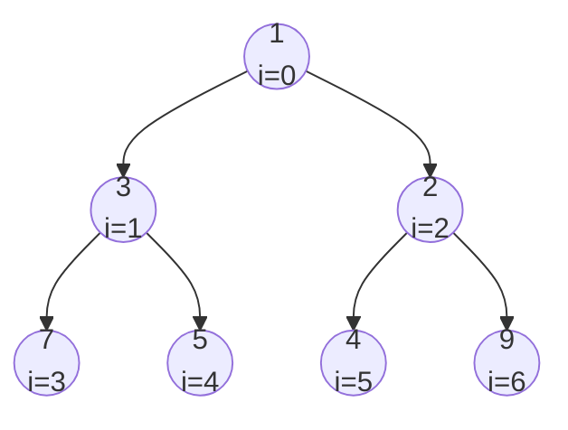

# Heap

A **heap** is a complete binary tree maintaining a partial order: every parent is $\le$ both children (**min-heap**) or $\ge$ both children (**max-heap**). It's the data structure underneath a **priority queue** — fast access to the smallest (or largest) element of a changing set.

The "complete" shape — every level full except possibly the last, which is filled left-to-right — lets the tree live entirely in a flat array, with no pointers:

```
index:   0   1   2   3   4   5   6
value:  [1,  3,  2,  7,  5,  4,  9]
```



For a node at index `i`:

- `left = 2*i + 1`
- `right = 2*i + 2`
- `parent = (i - 1) >> 1`

Operations and complexity:

| Operation                       | Cost                            | How                                                   |
| ------------------------------- | ------------------------------- | ----------------------------------------------------- |
| `peek`                          | $O(1)$                          | return `a[0]`                                         |
| `push(v)`                       | $O(\log n)$                     | append, then sift up                                  |
| `pop`                           | $O(\log n)$                     | swap root with last, pop last, sift down the new root |
| `heapify(arr)`                  | $O(n)$                          | sift-down from `n/2 - 1` down to `0`                  |
| arbitrary remove / decrease-key | $O(n)$ search + $O(\log n)$ fix | usually replaced with **lazy deletion**               |

`heapify` being $O(n)$ — not $O(n \log n)$ — is a tight analysis: most nodes are near the bottom and sift down only a constant number of levels.

## Implementation

```typescript
class MinHeap<T> {
  private a: T[] = [];
  constructor(private less: (x: T, y: T) => boolean = (x, y) => x < y) {}

  size(): number {
    return this.a.length;
  }

  peek(): T | undefined {
    return this.a[0];
  }

  push(v: T): void {
    this.a.push(v);
    this.siftUp(this.a.length - 1);
  }

  pop(): T | undefined {
    if (!this.a.length) return undefined;
    const top = this.a[0];
    const last = this.a.pop()!;
    if (this.a.length) {
      this.a[0] = last;
      this.siftDown(0);
    }
    return top;
  }

  private siftUp(i: number): void {
    while (i > 0) {
      const p = (i - 1) >> 1;
      if (!this.less(this.a[i], this.a[p])) break;
      [this.a[i], this.a[p]] = [this.a[p], this.a[i]];
      i = p;
    }
  }

  private siftDown(i: number): void {
    const n = this.a.length;
    while (true) {
      const l = 2 * i + 1,
        r = 2 * i + 2;
      let best = i;
      if (l < n && this.less(this.a[l], this.a[best])) best = l;
      if (r < n && this.less(this.a[r], this.a[best])) best = r;
      if (best === i) break;
      [this.a[i], this.a[best]] = [this.a[best], this.a[i]];
      i = best;
    }
  }
}
```

A **max-heap** is the same structure with the comparator flipped:

```typescript
const maxHeap = new MinHeap<number>((a, b) => a > b);
```

For tuples (priority + payload), pass a comparator that reads the priority slot:

```typescript
const pq = new MinHeap<[number, string]>(([p1], [p2]) => p1 < p2);
```

JavaScript has no built-in heap. For comparison: C++ `std::priority_queue` (max-heap by default), Python `heapq` (min-heap, free functions over a list), Java `PriorityQueue`, Rust `BinaryHeap` (max-heap).

### Bulk build via `heapify`

If you already have all $n$ elements up front, build in $O(n)$ instead of $n$ pushes:

```typescript
function heapify<T>(a: T[], less: (x: T, y: T) => boolean): void {
  for (let i = (a.length >> 1) - 1; i >= 0; i--) siftDown(a, i, less);
}
```

For one-shot top-K queries with a fixed input, this matters; for streaming inserts, you have no choice but per-element pushes.

## Where Heaps Are Used

| Use                       | Shape                                                               | Cost                            |
| ------------------------- | ------------------------------------------------------------------- | ------------------------------- |
| **Top-K / $k$-th largest**  | min-heap capped at size $k$ — push everything, pop when size $> k$   | $O(n \log k)$, $O(k)$ space     |
| **Running median**        | max-heap (low half) + min-heap (high half), sizes within one         | $O(\log n)$ insert, $O(1)$ read |
| **Merge $k$ sorted lists** | heap of the $k$ heads; pop one, push that list's next element        | $O(N \log k)$                   |
| **Dijkstra / Prim**       | heap of `(distance, vertex)` / `(edgeWeight, vertex)`                 | $O((V + E) \log V)$             |
| **Event simulation**      | heap of `(time, action)`; pop the next event, push what it spawns     | $O(\log n)$ per event           |
| **Scheduling**            | heap over the resource pool, keyed by "frees up at"                   | $O(\log n)$ per job             |
| **Top-$k$ frequent**       | count first, then heap of `(count, value)`                           | $O(n + k \log n)$               |

The capped-heap idiom is the one worth being able to write from memory — note it's a **min**-heap for the $k$ **largest**, so the thing you pop is the smallest candidate still in the running:

```typescript
function kthLargest(nums: number[], k: number): number {
  const h = new MinHeap<number>();
  for (const x of nums) {
    h.push(x);
    if (h.size() > k) h.pop();
  }
  return h.peek()!;
}
```

The common thread: the next decision depends on the extremum of a pool that keeps changing. If the pool were static you'd sort once; if you needed rank queries or deletion by key, you'd need a balanced BST instead.

> [!TIP]
> [215 Kth Largest Element in an Array](https://leetcode.com/problems/kth-largest-element-in-an-array/) (also doable in average $O(n)$ via Quickselect) · [347 Top K Frequent Elements](https://leetcode.com/problems/top-k-frequent-elements/) · [295 Find Median from Data Stream](https://leetcode.com/problems/find-median-from-data-stream/) · [23 Merge k Sorted Lists](https://leetcode.com/problems/merge-k-sorted-lists/) · [253 Meeting Rooms II](https://leetcode.com/problems/meeting-rooms-ii/)

## Lazy Deletion

The textbook decrease-key / arbitrary-remove is $O(n)$ to find the entry and $O(\log n)$ to fix the heap — usually not worth the bookkeeping. The standard workaround:

1. **Don't update entries in place.** When a value's priority changes, push the new entry; leave the old one.
2. **Skip stale entries on pop.** Maintain a side structure (set, dict, or just a freshness counter per key) that identifies stale entries; when one is popped, discard it and pop again.

This is how Dijkstra is usually implemented in practice — pushing a node multiple times is fine because the first pop is the one that mattered, and subsequent stale pops are filtered by a `if (d > dist[u]) continue;` guard.

## Heap vs. Other Structures

- **Sorted array / sorted list** — $O(1)$ peek and $O(\log n)$ binary-search insert position, but $O(n)$ to actually insert (shifting elements). Heap wins for streaming inserts.
- **Balanced BST / order-statistics tree** — supports peek, insert, delete-by-key, and rank queries all in $O(\log n)$. Strictly more general than a heap; pick a heap when you only need the extremum (smaller constants, simpler code).
- **Bucket / counting structure** — when priorities are small integers, a bucket queue (or a Van Emde Boas tree) beats $\log n$. Worth it only in dense, integer-keyed regimes.

If the problem says "next smallest", "kth largest", "merge sorted streams", "scheduler", or any phrasing that screams "I need the extremum of a changing set", reach for a heap first.
