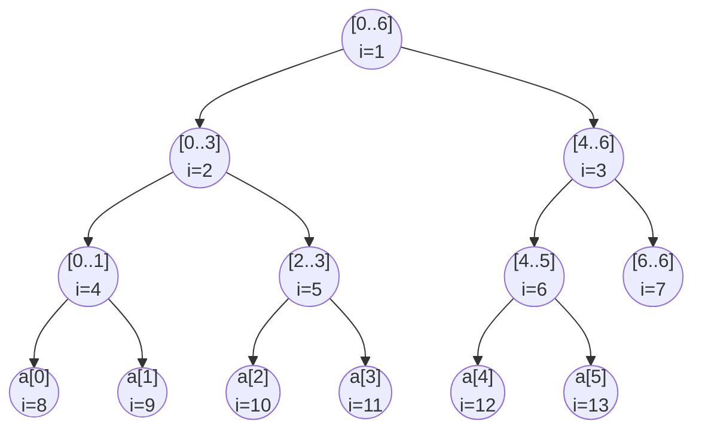

# Segment Tree

A **segment tree** answers _range queries_ and _point updates_ on a mutable array, both in $O(\log n)$. Each internal node stores the aggregate of a contiguous segment; leaves hold individual elements. The aggregate can be anything **associative** — sum, min, max, gcd, bitwise OR, matrix product — so the same skeleton handles a wide family of problems.

It's the heavyweight cousin of the [Fenwick Tree](./fenwick-tree.md): more code and ~2× memory, but it handles arbitrary monoids and supports **range updates with lazy propagation**, which Fenwick can't do cleanly.

When to reach for one:

- **Mutable array + range queries** where updates and queries interleave (Fenwick is enough if the monoid is a group — sum, XOR — and you only need point updates).
- **Range min / max / gcd / OR** — non-invertible operations that rule Fenwick out.
- **Range updates** ("add $v$ to every element in $[l, r]$" mixed with range queries) — requires lazy propagation.
- **Anything with a custom merge** that's associative — segment indices, longest-increasing-prefix, polynomial-hash concatenation, etc.

## Shape

For an array of size $n$, the tree is a complete-ish binary tree with the array at the leaves. Each node owns a range $[l, r]$; its children own $[l, m]$ and $[m+1, r]$ where $m = \lfloor (l + r) / 2 \rfloor$.

```
          [0..6]
         /      \
     [0..3]    [4..6]
     /   \     /   \
  [0..1][2..3][4..5][6..6]
   / \   / \   / \
  0   1 2   3 4   5
```



Like a heap, the tree lives in a flat array indexed from `1`:

- root is `1`
- children of `i` are `2*i` and `2*i + 1`
- parent of `i` is `i >> 1`

**Sizing.** A safe upper bound is $4n$. The tight bound is $2 \cdot 2^{\lceil \log_2 n \rceil}$, but $4n$ avoids the bit twiddling and the wasted slots are cheap. The reason it's not just $2n$: when $n$ isn't a power of two, the bottom layer is jagged, and the array indexing assumes a complete binary tree.

## Point Update, Range Query

Sum is the textbook example, but anywhere this code writes `+` you can substitute any associative operator with an identity element.

```typescript
class SegmentTree {
  private tree: number[];
  private n: number;

  constructor(arr: number[]) {
    this.n = arr.length;
    this.tree = new Array(4 * this.n).fill(0);
    if (this.n > 0) this.build(arr, 1, 0, this.n - 1);
  }

  private build(arr: number[], node: number, l: number, r: number): void {
    if (l === r) {
      this.tree[node] = arr[l];
      return;
    }
    const m = (l + r) >> 1;
    this.build(arr, 2 * node, l, m);
    this.build(arr, 2 * node + 1, m + 1, r);
    this.tree[node] = this.tree[2 * node] + this.tree[2 * node + 1];
  }

  update(i: number, val: number): void {
    this._update(1, 0, this.n - 1, i, val);
  }

  private _update(node: number, l: number, r: number, i: number, val: number): void {
    if (l === r) {
      this.tree[node] = val;
      return;
    }
    const m = (l + r) >> 1;
    if (i <= m) this._update(2 * node, l, m, i, val);
    else this._update(2 * node + 1, m + 1, r, i, val);
    this.tree[node] = this.tree[2 * node] + this.tree[2 * node + 1];
  }

  query(ql: number, qr: number): number {
    return this._query(1, 0, this.n - 1, ql, qr);
  }

  private _query(node: number, l: number, r: number, ql: number, qr: number): number {
    // disjoint → identity
    if (qr < l || r < ql) return 0;
    // fully covered → cached value
    if (ql <= l && r <= qr) return this.tree[node];
    const m = (l + r) >> 1;
    return this._query(2 * node, l, m, ql, qr)
         + this._query(2 * node + 1, m + 1, r, ql, qr);
  }
}
```

Three cases drive every recursion:

| Case             | Test                | Action                       |
| ---------------- | ------------------- | ---------------------------- |
| **Disjoint**     | `qr < l \|\| r < ql`  | return identity (`0` for sum) |
| **Fully inside** | `ql <= l && r <= qr` | return cached `tree[node]`   |
| **Partial**      | otherwise           | recurse into both children   |

The $O(\log n)$ bound on `query` holds because at each tree level the recursion visits **at most four nodes**: two boundary nodes on the way down to the left endpoint, two on the way to the right. Everything in between is a "fully inside" hit that short-circuits.

### Swapping the monoid

For range minimum, change three things — the identity, the merge, and (sometimes) the update — and nothing else:

```typescript
this.tree = new Array(4 * this.n).fill(Infinity);
// build / update / query:
this.tree[node] = Math.min(this.tree[2 * node], this.tree[2 * node + 1]);
// disjoint case:
return Infinity;
```

The structure of the recursion never changes — only the monoid does. That's why a real-world implementation often takes the identity and merge function as constructor parameters.

## Range Update with Lazy Propagation

Adding $v$ to every element of $[l, r]$ naïvely touches up to $O(n)$ leaves. The fix is **lazy propagation**: when a range update fully covers a node, stash the pending operation on the node and return without descending. Push it down only when a subsequent query or update needs to enter the subtree.

Two arrays in parallel:

- `tree[node]` — the aggregate **as if all pending laziness were applied**
- `lazy[node]` — the pending operation, **not yet applied** to the children

```typescript
class LazySegTree {
  private tree: number[];
  private lazy: number[];
  private n: number;

  constructor(n: number) {
    this.n = n;
    this.tree = new Array(4 * n).fill(0);
    this.lazy = new Array(4 * n).fill(0);
  }

  // add `val` to every element in [ql, qr]
  rangeAdd(ql: number, qr: number, val: number): void {
    this._rangeAdd(1, 0, this.n - 1, ql, qr, val);
  }

  // sum of [ql, qr]
  rangeSum(ql: number, qr: number): number {
    return this._rangeSum(1, 0, this.n - 1, ql, qr);
  }

  private push(node: number, l: number, r: number): void {
    if (this.lazy[node] === 0) return;
    const m = (l + r) >> 1;
    this.apply(2 * node, l, m, this.lazy[node]);
    this.apply(2 * node + 1, m + 1, r, this.lazy[node]);
    this.lazy[node] = 0;
  }

  // apply `val` to a node that owns [l, r]
  private apply(node: number, l: number, r: number, val: number): void {
    this.tree[node] += (r - l + 1) * val;
    this.lazy[node] += val;
  }

  private _rangeAdd(node: number, l: number, r: number, ql: number, qr: number, val: number): void {
    if (qr < l || r < ql) return;
    if (ql <= l && r <= qr) {
      this.apply(node, l, r, val);
      return;
    }
    this.push(node, l, r);
    const m = (l + r) >> 1;
    this._rangeAdd(2 * node, l, m, ql, qr, val);
    this._rangeAdd(2 * node + 1, m + 1, r, ql, qr, val);
    this.tree[node] = this.tree[2 * node] + this.tree[2 * node + 1];
  }

  private _rangeSum(node: number, l: number, r: number, ql: number, qr: number): number {
    if (qr < l || r < ql) return 0;
    if (ql <= l && r <= qr) return this.tree[node];
    this.push(node, l, r);
    const m = (l + r) >> 1;
    return this._rangeSum(2 * node, l, m, ql, qr)
         + this._rangeSum(2 * node + 1, m + 1, r, ql, qr);
  }
}
```

Two invariants keep the bookkeeping straight:

1. `tree[node]` is always **correct for its range** — the aggregate reflects every update that has ever touched this node, including ones that haven't been pushed down yet.
2. `lazy[node]` is what the **children still owe**. After `push`, the parent's lazy is cleared because the children now know.

`apply` multiplies `val` by the range length `r - l + 1` because each of the elements in the range gets `+val` — the **sum** gains `(r - l + 1) * val`. For range min/max with range-add, no length factor: every element increases by `val`, so the min increases by `val`.

### Composing lazy values

For range-add, lazy values compose by addition (`+=`). For **range-assign** (set every element to $v$), composition is overwrite — the newer assignment wipes the older. Mixing range-add and range-assign requires a richer lazy representation (an `(assign?, add)` pair, applied in that order). Get the composition law right and the rest is mechanical.

## Building in $O(n)$

The recursive `build` shown above already runs in $O(n)$ — there's one constant-time merge per node, and the tree has $O(n)$ nodes. No heapify-style trick is needed; segment trees are naturally bottom-up when written recursively post-order.

## Iterative ("Bottom-Up") Form

For point-update / range-query without lazy, there's a tight iterative form that's roughly 2× faster in practice and easier to get right. Store the tree of size $2n$, with leaves at indices `[n, 2n)`:

```typescript
class IterativeSegTree {
  private tree: number[];
  private n: number;

  constructor(arr: number[]) {
    this.n = arr.length;
    this.tree = new Array(2 * this.n).fill(0);
    for (let i = 0; i < this.n; i++) this.tree[this.n + i] = arr[i];
    for (let i = this.n - 1; i > 0; i--) {
      this.tree[i] = this.tree[2 * i] + this.tree[2 * i + 1];
    }
  }

  update(i: number, val: number): void {
    for (this.tree[i += this.n] = val; i > 1; i >>= 1) {
      this.tree[i >> 1] = this.tree[i] + this.tree[i ^ 1];
    }
  }

  // sum of [l, r]
  query(l: number, r: number): number {
    let res = 0;
    for (l += this.n, r += this.n + 1; l < r; l >>= 1, r >>= 1) {
      if (l & 1) res += this.tree[l++];
      if (r & 1) res += this.tree[--r];
    }
    return res;
  }
}
```

The trick: `l` and `r` walk up the tree. Whenever `l` is a **right child** (odd), it can't ride up with its parent — collect it and slide right. Symmetrically for `r` as a left child. This generalizes the four-boundary-node argument from the recursive version into pure index math.

This form **doesn't admit lazy propagation cleanly** — you need the recursive structure to push down on the way in. For lazy, stay with the recursive version.

## Generalizations

- **2D segment tree** — a segment tree of segment trees. $O(\log^2 n)$ per query, $O(n^2)$ space. Use only when sparser structures (2D Fenwick, k-d tree, offline sweep) don't fit.
- **Persistent segment tree** — every update creates new nodes along the affected path ($O(\log n)$ new nodes), leaving older versions intact. Used for "what was the array at time $t$?" queries, or for problems like "kth smallest in a range" via persistent counts.
- **Merge-sort tree / wavelet tree** — segment tree where each node stores a **sorted list** of its range. Answers "how many elements in $[l, r]$ are $\le x$" in $O(\log^2 n)$.
- **Segment tree beats** — supports range updates like "chmin every element with $v$" using amortized $O(\log^2 n)$ via tracking the top one or two values per node.

## Segment Tree vs. Fenwick Tree

| Concern                        | Fenwick                       | Segment                         |
| ------------------------------ | ----------------------------- | ------------------------------- |
| Point update + prefix/range query | ✅ tiny, fast                 | works but heavier               |
| Range update + range query     | possible (two-BIT trick, sum only) | natural fit (lazy propagation)  |
| Non-invertible op (min, max, gcd) | ❌ no — needs inverses        | ✅ any associative monoid       |
| Memory                         | $n$                           | $2n$ (iterative) or $4n$ (recursive) |
| Code length                    | ~10 lines                     | ~50+ lines                      |
| Constant factor                | smaller                       | larger                          |

The rule of thumb: **reach for Fenwick first**; upgrade to segment tree the moment you need range updates with non-trivial composition, or an operation without an inverse.

> [!TIP]
> [307 Range Sum Query - Mutable](https://leetcode.com/problems/range-sum-query-mutable/) (the canonical point-update / range-query) · [2407 Longest Increasing Subsequence II](https://leetcode.com/problems/longest-increasing-subsequence-ii/) (range-max over values — LIS with a constraint) · [699 Falling Squares](https://leetcode.com/problems/falling-squares/) (range-assign + range-max, lazy) · [732 My Calendar III](https://leetcode.com/problems/my-calendar-iii/) (range-add + range-max) · [715 Range Module](https://leetcode.com/problems/range-module/) (range-assign, coordinate-compressed)
