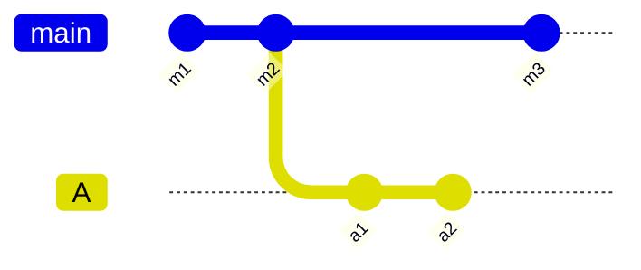
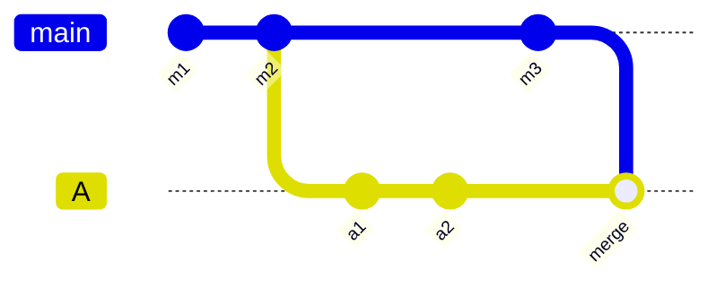
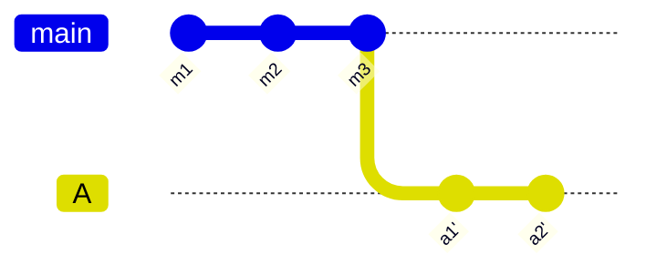

# Git & GitHub Tricks

## Custom Syntax Highlighting

You can use `.gitattributes` to specify custom syntax highlighting for files in GitHub. For example, if you have a file with a non-standard extension but want it to be highlighted as Python, you can add the following line to your `.gitattributes` file:

```sh
# treat all .myext files as Python for syntax highlighting
*.myext linguist-language=Python
```

This will tell GitHub to treat files with the `.myext` extension as Python files for syntax highlighting purposes.

## Linguist-Ignored Code

You can use `.gitattributes` to ignore certain files or directories from being displayed in diffs on GitHub. Such files can be auto-generated / vendored, so you would not want them to populate your diffs.

```sh
# ignore docs
docs/* linguist-vendored

# ignore auto-generated proto files
proto/* linguist-generated
```

## Git Logs for a File

You can use `git log --follow <file>` to see the commit history of a file, including renames. This is useful when you want to track the history of a file that has been renamed or moved in the repository.

```sh
git log --follow path/to/your/file
```

You can get a short summary of commits between your current version and the last version of the file with:

```sh
git log --follow --oneline path/to/your/file
```

## Merge vs Rebase

Both **merge** and **rebase** integrate changes from one branch into another; they differ in how history is reshaped.

- **Merge** records a new _merge commit_ that ties two histories together. Existing commits are untouched, so history is preserved exactly as it happened — at the cost of extra merge commits and a non-linear graph.
- **Rebase** replays your commits on top of another branch, creating _new_ commits with new hashes. History becomes linear and clean, but you are rewriting it.



Say `main` advanced to `m3` after you branched off at `m2`. You want those new `main` commits in your branch `A` (which has PR `A -> main`).

### Pulling `main` into your PR with merge

```sh
git switch A
git merge main
```

This creates a merge commit on `A` that brings in `m3`. The graph stays branched:



- Your commits `a1`, `a2` keep their original hashes.
- Safe for **shared branches** — no force-push, collaborators' clones stay valid.
- Downsides: an extra merge commit and interleaved history, and you resolve all conflicts at once in a single commit.

### Pulling `main` into your PR with rebase

```sh
git switch A
git rebase main
# resolve conflicts per replayed commit, then:
git rebase --continue
```

This replays `a1`, `a2` on top of `m3` as new commits `a1'`, `a2'`:



- History is linear, as if you had branched off `m3` to begin with.
- Conflicts are resolved **commit-by-commit**, which can be more granular but means multiple rounds.
- Because the commits are rewritten, you must **force-push**:

  ```sh
  git push --force-with-lease
  ```

  Prefer `--force-with-lease` over `--force`: it refuses the push if the remote moved unexpectedly, protecting against clobbering someone else's work.

### Which to use

- **Rebase** for a feature branch you own (your PR branch), to keep `main` integration clean and the PR diff readable. The classic rule: _rebase your local/private work, never rebase shared history_.
- **Merge** when the branch is shared with others, or when you want to preserve the exact integration history.
- Some teams sidestep the choice by configuring **"Squash and merge"** or **"Rebase and merge"** on the PR itself, so the branch's internal history is normalized at merge time regardless of how you kept it up to date.

## Worktrees

A **worktree** lets you check out multiple branches of the same repository into separate directories at once, all sharing a single `.git` store. Instead of stashing changes and switching branches in place, you get a second working directory with its own checked-out branch — handy for reviewing a PR, running a long build, or hotfixing `main` without disturbing your in-progress work.

```sh
# create a worktree in ../hotfix checked out to a new branch `fix`
git worktree add ../hotfix -b fix

# or check out an existing branch
git worktree add ../review existing-branch
```

Each worktree is a normal directory you can `cd` into and work in independently. They share the object database, so commits made in one are immediately visible to the others (`git log`, fetches, etc.).

```sh
# list all worktrees and their checked-out branches
git worktree list
```

A branch can only be checked out in **one** worktree at a time — trying to check it out in a second worktree fails. This prevents two directories from racing on the same branch.

When you are done, remove the worktree and prune its metadata:

```sh
# remove a worktree (its directory must be clean)
git worktree remove ../hotfix

# clean up stale entries (e.g. if you deleted the directory manually)
git worktree prune
```

Worktrees pair well with rebasing a PR branch: keep your main work in the primary checkout and do the integration/conflict resolution in a throwaway worktree, so a botched rebase never touches your main directory.
