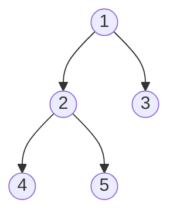
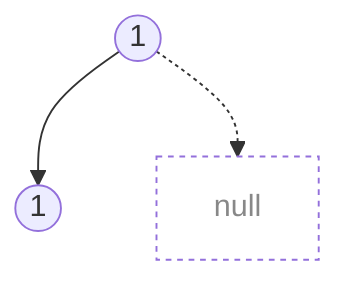
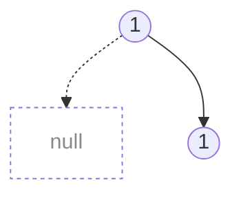
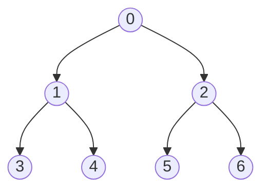

# Binary Trees

A rooted tree where every node has **at most two children** — conventionally `left` and `right`. The structure is recursive: each subtree is itself a binary tree, which is why nearly every algorithm on them is a one-line recursion plus a combine step.

The core move: solve for the left subtree, solve for the right subtree, then combine with the current node. Most of the skill is picking the **direction of information flow** — top-down (pass context down the recursion) vs bottom-up (return a value up). Getting that choice right often turns a hard problem into a five-line DFS.

Common specializations:

- **Binary Search Tree (BST)** — left subtree values $<$ node $<$ right subtree values. In-order traversal yields sorted order; search / insert / delete in $O(h)$.
- **Heap** — complete shape + partial order (parent $\le$ or $\ge$ children). Priority-queue operations in $O(\log n)$ on an implicit array.
- **Balanced trees** (AVL, red-black, treap) — $O(\log n)$ height guaranteed, at the cost of rotation bookkeeping.

Problem patterns to recognize:

- **Traversal** — preorder, inorder, postorder, level-order. Each exposes a different invariant (BST $\to$ inorder is sorted; postorder is the natural order for bottom-up aggregation).
- **Aggregations** — depth, height, diameter, subtree sum, path sum. Almost always a post-order DFS returning a structured value (e.g. `[heightHere, bestAnswerSoFar]`).
- **Construction** — rebuild from a pair of traversals (preorder + inorder, postorder + inorder); the recursive structure of traversals is exactly the recursive structure of the tree.
- **Path queries** — lowest common ancestor (LCA), root-to-leaf paths, longest path through a node.
- **Structural hashing** — serialize each subtree into a canonical string to detect duplicates or equality.

General graph algorithms (BFS/DFS, cycle detection, shortest paths, topological order) live in [Graphs](./graphs.md). The techniques below are specifically those that exploit the two-children-per-node structure.

## Traversal Orders

Given a tree:



| Order         | Visit pattern    | Result          |
| ------------- | ---------------- | --------------- |
| **Preorder**  | cur, left, right | `1, 2, 4, 5, 3` |
| **Inorder**   | left, cur, right | `4, 2, 5, 1, 3` |
| **Postorder** | left, right, cur | `4, 5, 2, 3, 1` |

### Recursive (trivial)

```typescript
function preorder(node: TreeNode | null, result: number[]) {
  if (!node) return;
  result.push(node.val); // visit
  preorder(node.left, result);
  preorder(node.right, result);
}
```

Swap the `push` line to middle for inorder, to end for postorder.

### Iterative with Stack

The stack replaces the call stack. Each order handles it differently.

**Preorder** — most straightforward. Push right first so left is processed first:

```typescript
function preorder(root: TreeNode): number[] {
  const result: number[] = [];
  const stack: TreeNode[] = [root];

  while (stack.length) {
    const node = stack.pop()!;
    result.push(node.val); // visit immediately
    if (node.right) stack.push(node.right); // right first
    if (node.left) stack.push(node.left); // so left pops first
  }

  return result;
}
```

**Inorder** — go as far left as possible, then visit, then go right:

```typescript
function inorder(root: TreeNode): number[] {
  const result: number[] = [];
  const stack: TreeNode[] = [];
  let cur: TreeNode | null = root;

  while (cur || stack.length) {
    // drill down left
    while (cur) {
      stack.push(cur);
      cur = cur.left;
    }
    // visit
    cur = stack.pop()!;
    result.push(cur.val);
    // go right
    cur = cur.right;
  }

  return result;
}
```

**Postorder** — trick: do a modified preorder (cur, right, left) and reverse the result:

```typescript
function postorder(root: TreeNode): number[] {
  const result: number[] = [];
  const stack: TreeNode[] = [root];

  while (stack.length) {
    const node = stack.pop()!;
    result.push(node.val); // cur
    if (node.left) stack.push(node.left); // left first
    if (node.right) stack.push(node.right); // so right pops first
  }

  return result.reverse(); // reverse: cur,right,left → left,right,cur
}
```

This works because postorder (`left, right, cur`) is the reverse of a modified preorder (`cur, right, left`).

### Summary

| Order     | Stack approach                                  |
| --------- | ----------------------------------------------- |
| Preorder  | Pop → visit → push right, left                  |
| Inorder   | Drill left, pop → visit → go right              |
| Postorder | Modified preorder (right before left) → reverse |

### Reverse Preorder (cur, right, left)

Swapping the child visit order gives a **reverse preorder** (NRL). Useful when you need the rightmost node at each depth first — e.g. "right side view" of a tree:

```typescript
const stack: [TreeNode, number][] = [[root, 0]]; // [node, depth]

while (stack.length) {
  const [node, depth] = stack.pop()!;
  if (depth === result.length) result.push(node.val); // first at this depth = rightmost

  if (node.left) stack.push([node.left, depth + 1]); // left first
  if (node.right) stack.push([node.right, depth + 1]); // so right pops first
}
```

Since right children are popped first, the first node seen at each depth is always the rightmost. The `depth === result.length` check ensures we only record it once per level.

## Serialization (Subtree Hashing)

To detect duplicate subtrees, serialize each subtree into a string key.

### Which traversal order works?

**Preorder** (`cur_left_right`) works without parens:

```typescript
const key = `${node.val}_${left}_${right}`;
```

**Inorder** and **postorder** are ambiguous without explicit grouping:

<div style="display: flex; gap: 2rem; justify-content: center;">





</div>

```
Inorder, both trees:  "NULL_1_NULL_1_NULL"   (same!)
Preorder, tree A:     "1_1_NULL_NULL_NULL"
Preorder, tree B:     "1_NULL_1_NULL_NULL"   (different — preorder disambiguates)
```

**With parentheses**, any order works:

```typescript
const key = `(${left})${node.val}(${right})`; // inorder, safe
const key = `(${node.val},${left},${right})`; // uniform, safe
```

The parens explicitly encode tree structure, making ordering irrelevant.

## Max Width (Heap Indexing)

For maximum width of a binary tree (counting nulls between endpoints), assign heap indices:

- Root has index $0$
- Left child of index $i$: $2i$
- Right child of index $i$: $2i + 1$

Width of a level $= \text{lastIndex} - \text{firstIndex} + 1$.



Use DFS tracking first index per depth:

```typescript
const firstAt: Record<number, bigint> = {};
let maxWidth = 0n;

function dfs(node: TreeNode | null, depth: number, idx: bigint) {
  if (!node) return;
  if (!(depth in firstAt)) firstAt[depth] = idx;

  const width = idx - firstAt[depth] + 1n;
  if (width > maxWidth) maxWidth = width;

  dfs(node.left, depth + 1, 2n * idx);
  dfs(node.right, depth + 1, 2n * idx + 1n);
}
```

Use `BigInt` since indices double each level and can overflow.

## LIS (Patience Sorting)

Maintain a sorted `tails` array where $\text{tails}[k]$ = smallest tail of any increasing subsequence of length $k + 1$:

```typescript
const tails: number[] = [];

for (const num of nums) {
  let l = 0,
    r = tails.length;
  while (l < r) {
    const mid = (l + r) >> 1;
    if (tails[mid] < num) l = mid + 1;
    else r = mid;
  }
  tails[l] = num; // replace or append
}

return tails.length;
```

`tails` is always sorted so binary search is valid. `tails[l] = num` handles both replace and append — assigning to `arr[arr.length]` extends the array in JS.

Note: `tails` is **not** the actual LIS sequence, just the optimal tail values. To recover the actual sequence, store predecessor indices.
