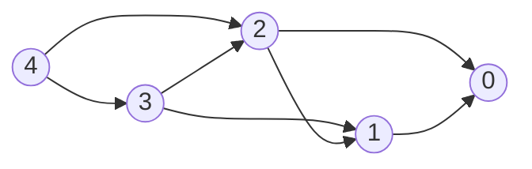

# Dynamic Programming

**Dynamic programming (DP)** solves a problem by expressing its answer in terms of answers to smaller instances of the same shape, then caching those answers so each is computed once. Two ingredients are required:

- **Optimal substructure** — the global optimum decomposes into optima of subproblems.
- **Overlapping subproblems** — the same subproblem is encountered along many decomposition paths. Without overlap, plain recursion (or divide-and-conquer) is enough; the cache buys nothing.

If a problem has only the first, you don't need DP. If it has both, DP turns exponential recursion into polynomial table-fill.

## DP as a State Machine

The most useful frame: **a DP is a value function on a finite-state DAG**.

- **States** $S$ — the parameters that uniquely identify a subproblem (the memoization key). E.g. for knapsack: `(itemIndex, capacityLeft)`.
- **Transitions** $s \to s'$ — the choices available at $s$. Each transition may carry a cost / reward / weight $w(s, s')$.
- **Value function** $V(s)$ — the answer to the subproblem at $s$, computed by combining $V$ over outgoing transitions:

$$V(s) = \bigoplus_{s \to s'} \big( w(s, s') \,\cdot\, V(s') \big)$$

The combinator $\oplus$ is what kind of DP it is:

| $\oplus$ | What you're computing                          |
| -------- | ---------------------------------------------- |
| `min`    | Shortest / cheapest path (e.g. coin change)    |
| `max`    | Longest / most-valuable path (e.g. LIS, LCS)   |
| `sum`    | Counting paths or expectation (e.g. paths in a grid) |
| `or`     | Reachability / feasibility (e.g. subset sum)   |

The DAG-ness is essential: if state transitions had cycles, $V(s)$ would depend on itself and the recurrence wouldn't bottom out. Picking the right state space is exactly the act of finding parameters that make the dependency graph acyclic.

### Tiny worked example: climbing stairs

"How many ways to climb $n$ stairs taking 1 or 2 at a time?" State $i$ = stairs left; transitions $i \to i-1$ and $i \to i-2$; combinator is `sum`; base case $V(0) = 1$.

For $n = 4$:



$V(0) = 1, V(1) = 1, V(2) = 2, V(3) = 3, V(4) = 5$. Compute in reverse-topological order (leaves first), which here means small-to-large $i$. The whole point is that $V(2)$ is reached from both $V(4)$ and $V(3)$ — overlap — so caching it once turns an exponential walk into linear-time fill.

### Top-down vs bottom-up

Two equivalent ways to traverse the state DAG:

- **Top-down (memoized recursion).** DFS from the goal state, compute children on demand, store results in a map/array. Lazy — only states actually reachable from the goal get computed. Easier to write when the state space is sparse or transitions are awkward to enumerate forward.
- **Bottom-up (tabulation).** Iterate states in topological order (leaves first), filling a table. Eager — every state in the chosen range is filled. Easier to reason about cache locality and to apply space-rolling tricks.

Pick top-down when the recurrence is natural to write recursively, bottom-up when you want tight loops or rolling-window space optimization. Correctness is identical; constant factors and code length differ.

```typescript
// top-down
const memo = new Map<string, number>();
function solve(s: State): number {
  const k = key(s);
  if (memo.has(k)) return memo.get(k)!;
  if (isBase(s)) return baseValue(s);
  let best = identity;
  for (const [w, sNext] of transitions(s)) best = combine(best, w * solve(sNext));
  memo.set(k, best);
  return best;
}

// bottom-up
for (const s of statesInTopoOrder()) {
  if (isBase(s)) { V[s] = baseValue(s); continue; }
  let best = identity;
  for (const [w, sNext] of transitions(s)) best = combine(best, w * V[sNext]);
  V[s] = best;
}
```

## Recipe

When a problem looks DP-shaped, work through it in this order:

1. **State.** What parameters identify a subproblem? Smaller is better — extra parameters multiply the table size.
2. **Transitions.** From a state, what choices lead to which next states, with what cost/reward?
3. **Base cases.** States with no outgoing transitions; their values are given directly.
4. **Combinator.** `min`, `max`, `sum`, `or`, …
5. **Order.** Topological order on the state DAG — usually obvious once the state is right (loop indices typically go in the natural direction of one of the parameters).
6. **Answer.** Which state's value is the final answer? Often $V(\text{start})$ or $V(n)$.

If step 1 is hard, that's the problem. Once the state is right, the rest is mechanical.

## 1D DP

State indexed by a single integer. Recurrence usually $V(i) = f(V(i-1), V(i-2), \ldots)$.

**House robber** — max sum of non-adjacent picks.

```typescript
function rob(nums: number[]): number {
  let prev2 = 0,
    prev1 = 0;
  for (const x of nums) {
    const curr = Math.max(prev1, prev2 + x);
    prev2 = prev1;
    prev1 = curr;
  }
  return prev1;
}
```

State $i$ = "best using `nums[0..i)`"; transitions skip or take `nums[i-1]`. Only the last two values matter — a $O(1)$-space rolling-window optimization that's available whenever $V(i)$ depends only on a constant prefix of prior values.

**Longest Increasing Subsequence (LIS)** — $O(n^2)$ DP, or $O(n \log n)$ via patience sorting + binary search (see [Binary Search](./binary-search.md)).

```typescript
const dp = new Array(n).fill(1);
for (let i = 1; i < n; i++)
  for (let j = 0; j < i; j++)
    if (nums[j] < nums[i]) dp[i] = Math.max(dp[i], dp[j] + 1);
return Math.max(...dp);
```

## 2D DP

State indexed by two integers — typically two strings/arrays, or one array plus a numeric parameter.

**0/1 Knapsack.** State `(i, w)` = "best value using items `[0..i)` with capacity $w$".

```typescript
const dp: number[][] = Array.from({ length: n + 1 }, () => new Array(W + 1).fill(0));
for (let i = 1; i <= n; i++) {
  for (let w = 0; w <= W; w++) {
    dp[i][w] = dp[i - 1][w]; // skip item i-1
    if (weight[i - 1] <= w)
      dp[i][w] = Math.max(dp[i][w], dp[i - 1][w - weight[i - 1]] + value[i - 1]);
  }
}
return dp[n][W];
```

Row $i$ depends only on row $i-1$, so a rolling 1D array suffices — but iterate $w$ **descending** so `dp[w - weight[i-1]]` still refers to the previous row.

**Edit Distance.** State `(i, j)` = edit distance between `a[0..i)` and `b[0..j)`. Three transitions: insert, delete, replace.

```typescript
for (let i = 0; i <= a.length; i++) dp[i][0] = i;
for (let j = 0; j <= b.length; j++) dp[0][j] = j;
for (let i = 1; i <= a.length; i++) {
  for (let j = 1; j <= b.length; j++) {
    dp[i][j] =
      a[i - 1] === b[j - 1]
        ? dp[i - 1][j - 1]
        : 1 + Math.min(dp[i - 1][j - 1], dp[i - 1][j], dp[i][j - 1]);
  }
}
```

The same skeleton (LCS, palindrome partitioning, regex matching) recurs constantly — once you spot two indices over two sequences, write the recurrence over `(i, j)` and look at the three or four neighbors.

## DP on Other Structures

- **DP on trees** — state per subtree, recurrence at each node combines children's values. Examples: max independent set on a tree, tree diameter, rerooting. Lives in postorder DFS; see [Binary Trees](./binary-trees.md).
- **DP on DAGs** — directly the picture above; topological order is the iteration order. Shortest path on a DAG is a DP.
- **DP with bitmask state** — when a state needs "which subset of $n$ elements have been used", encode as a bitmask `s ∈ [0, 2^n)`. Workable up to $n \approx 20$.
- **Digit DP** — state is `(position, tight, leadingZero, …)` for counting numbers $\le N$ with some property. The state machine view makes the construction systematic.

## Common Pitfalls

- **Wrong state.** If two configurations with different futures map to the same state, the DP will be wrong. Add the missing parameter — even at the cost of a larger table.
- **Wrong order.** Bottom-up requires topological order on the state DAG. If $V(i)$ reads $V(i+1)$, iterate $i$ descending.
- **Recomputing inside the recurrence.** The whole point is that each state is solved once — make sure the memo table is checked before doing any work.
- **Counting double-counted paths.** For "number of ways", make sure the recurrence partitions the configurations (each is reached via exactly one transition path), or you'll overcount.
