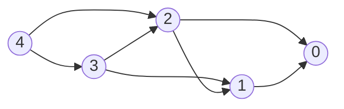

# Dynamic Programming

**Dynamic programming (DP)** solves a problem by expressing its answer in terms of answers to smaller instances of the same shape, then caching those answers so each is computed once. Two ingredients are required:

- **Optimal substructure** — the global optimum decomposes into optima of subproblems.
- **Overlapping subproblems** — the same subproblem is encountered along many decomposition paths. Without overlap, plain recursion (or divide-and-conquer) is enough; the cache buys nothing.

If a problem has only the first, you don't need DP. If it has both, DP turns exponential recursion into polynomial table-fill.

## DP as a State Machine

The most useful frame: **a DP is a value function on a finite-state DAG**.

- **States** $S$ — the parameters that uniquely identify a subproblem (the memoization key). E.g. for knapsack: `(itemIndex, capacityLeft)`.
- **Transitions** $s \to s'$ — the choices available at $s$. Each transition may carry a cost / reward / weight $w(s, s')$.
- **Value function** $V(s)$ — the answer to the subproblem at $s$, computed by combining $V$ over outgoing transitions:

$$V(s) = \bigoplus_{s \to s'} \big( w(s, s') \,\cdot\, V(s') \big)$$

The combinator $\oplus$ is what kind of DP it is:

| $\oplus$ | What you're computing                                |
| -------- | ---------------------------------------------------- |
| `min`    | Shortest / cheapest path (e.g. coin change)          |
| `max`    | Longest / most-valuable path (e.g. LIS, LCS)         |
| `sum`    | Counting paths or expectation (e.g. paths in a grid) |
| `or`     | Reachability / feasibility (e.g. subset sum)         |

The DAG-ness is essential: if state transitions had cycles, $V(s)$ would depend on itself and the recurrence wouldn't bottom out. Picking the right state space is exactly the act of finding parameters that make the dependency graph acyclic.

### Tiny worked example: climbing stairs

"How many ways to climb $n$ stairs taking 1 or 2 at a time?" State $i$ = stairs left; transitions $i \to i-1$ and $i \to i-2$; combinator is `sum`; base case $V(0) = 1$.

For $n = 4$:



$V(0) = 1, V(1) = 1, V(2) = 2, V(3) = 3, V(4) = 5$. Compute in reverse-topological order (leaves first), which here means small-to-large $i$. The whole point is that $V(2)$ is reached from both $V(4)$ and $V(3)$ — overlap — so caching it once turns an exponential walk into linear-time fill.

### Top-down vs bottom-up

Two equivalent ways to traverse the state DAG:

- **Top-down (memoized recursion).** DFS from the goal state, compute children on demand, store results in a map/array. Lazy — only states actually reachable from the goal get computed. Easier to write when the state space is sparse or transitions are awkward to enumerate forward.
- **Bottom-up (tabulation).** Iterate states in topological order (leaves first), filling a table. Eager — every state in the chosen range is filled. Easier to reason about cache locality and to apply space-rolling tricks.

Pick top-down when the recurrence is natural to write recursively, bottom-up when you want tight loops or rolling-window space optimization. Correctness is identical; constant factors and code length differ.

```typescript
// top-down
const memo = new Map<string, number>();
function solve(s: State): number {
  const k = key(s);
  if (memo.has(k)) return memo.get(k)!;
  if (isBase(s)) return baseValue(s);
  let best = identity;
  for (const [w, sNext] of transitions(s))
    best = combine(best, w * solve(sNext));
  memo.set(k, best);
  return best;
}

// bottom-up
for (const s of statesInTopoOrder()) {
  if (isBase(s)) {
    V[s] = baseValue(s);
    continue;
  }
  let best = identity;
  for (const [w, sNext] of transitions(s)) best = combine(best, w * V[sNext]);
  V[s] = best;
}
```

## Recipe

When a problem looks DP-shaped, work through it in this order:

1. **State.** What parameters identify a subproblem? Smaller is better — extra parameters multiply the table size.
2. **Transitions.** From a state, what choices lead to which next states, with what cost/reward?
3. **Base cases.** States with no outgoing transitions; their values are given directly.
4. **Combinator.** `min`, `max`, `sum`, `or`, …
5. **Order.** Topological order on the state DAG — usually obvious once the state is right (loop indices typically go in the natural direction of one of the parameters).
6. **Answer.** Which state's value is the final answer? Often $V(\text{start})$ or $V(n)$.

If step 1 is hard, that's the problem. Once the state is right, the rest is mechanical.

## 1D DP

State indexed by a single integer. Recurrence usually $V(i) = f(V(i-1), V(i-2), \ldots)$.

**House robber** — max sum of non-adjacent picks.

```typescript
function rob(nums: number[]): number {
  let prev2 = 0,
    prev1 = 0;
  for (const x of nums) {
    const curr = Math.max(prev1, prev2 + x);
    prev2 = prev1;
    prev1 = curr;
  }
  return prev1;
}
```

State $i$ = "best using `nums[0..i)`"; transitions skip or take `nums[i-1]`. Only the last two values matter — a $O(1)$-space rolling-window optimization that's available whenever $V(i)$ depends only on a constant prefix of prior values.

**Longest Increasing Subsequence (LIS)** — $O(n^2)$ DP, or $O(n \log n)$ via patience sorting + binary search (see [Binary Search](./binary-search.md)).

```typescript
const dp = new Array(n).fill(1);
for (let i = 1; i < n; i++)
  for (let j = 0; j < i; j++)
    if (nums[j] < nums[i]) dp[i] = Math.max(dp[i], dp[j] + 1);
return Math.max(...dp);
```

## 2D DP

State indexed by two integers — typically two strings/arrays, or one array plus a numeric parameter.

**0/1 Knapsack.** State `(i, w)` = "best value using items `[0..i)` with capacity $w$".

```typescript
const dp: number[][] = Array.from({ length: n + 1 }, () =>
  new Array(W + 1).fill(0),
);
for (let i = 1; i <= n; i++) {
  for (let w = 0; w <= W; w++) {
    dp[i][w] = dp[i - 1][w]; // skip item i-1
    if (weight[i - 1] <= w)
      dp[i][w] = Math.max(
        dp[i][w],
        dp[i - 1][w - weight[i - 1]] + value[i - 1],
      );
  }
}
return dp[n][W];
```

Row $i$ depends only on row $i-1$, so a rolling 1D array suffices — but iterate $w$ **descending** so `dp[w - weight[i-1]]` still refers to the previous row.

**Edit Distance.** State `(i, j)` = edit distance between `a[0..i)` and `b[0..j)`. Three transitions: insert, delete, replace.

```typescript
for (let i = 0; i <= a.length; i++) dp[i][0] = i;
for (let j = 0; j <= b.length; j++) dp[0][j] = j;
for (let i = 1; i <= a.length; i++) {
  for (let j = 1; j <= b.length; j++) {
    dp[i][j] =
      a[i - 1] === b[j - 1]
        ? dp[i - 1][j - 1]
        : 1 + Math.min(dp[i - 1][j - 1], dp[i - 1][j], dp[i][j - 1]);
  }
}
```

The same skeleton (LCS, palindrome partitioning, regex matching) recurs constantly — once you spot two indices over two sequences, write the recurrence over `(i, j)` and look at the three or four neighbors.

## DP on Other Structures

- **DP on trees** — state per subtree, recurrence at each node combines children's values. Examples: max independent set on a tree, tree diameter, rerooting. Lives in postorder DFS; see [Binary Trees](./binary-trees.md).
- **DP on DAGs** — directly the picture above; topological order is the iteration order. Shortest path on a DAG is a DP.
- **DP with bitmask state** — when a state needs "which subset of $n$ elements have been used", encode as a bitmask `s ∈ [0, 2^n)`; see the dedicated section below.
- **Digit DP** — counting integers $\le N$ with a digit-level property; see the dedicated section below.

## Bitmask DP

When a state needs "which subset of $n$ elements has been used / visited / chosen", encode the subset as an integer `mask ∈ [0, 2^n)` — bit $i$ is $1$ iff element $i$ is in the set. The whole subset lattice indexes a single flat array, and transitions become bit operations. The trade-off is that $n$ must be small: $2^n$ is the table size, so $n \le 20$ or so is the practical ceiling ($2^{20} \approx 10^6$).

Use bitmask DP when the state has to remember the **identity** of the set, not just its size — two configurations covering different elements are not interchangeable even at the same count. Classic shapes: traveling salesman, assignment, set cover, Hamiltonian-path counting, partition into groups.

### The trick: subset as integer

| Op                   | Meaning                                |
| -------------------- | -------------------------------------- |
| `mask & (1 << i)`    | is element $i$ in the set?             |
| `mask \| (1 << i)`   | add element $i$                        |
| `mask & ~(1 << i)`   | remove element $i$                     |
| `mask ^ (1 << i)`    | toggle element $i$                     |
| `mask & (mask - 1)`  | clear lowest set bit                   |
| `s = (s - 1) & mask` | step to next non-empty submask of mask |

Iteration order is the natural topological order on the subset lattice: if transitions only _add_ elements, iterate `mask` ascending — every `mask'` with `mask' ⊃ mask` comes later. If transitions _remove_ elements, iterate descending.

### State

Two shapes recur:

- **`(mask, position)`** — when which element was placed last matters (TSP, Hamiltonian paths, "best path through a chosen subset"). The mask records _what_, the position records _where you are_.
- **`mask`** alone — when only the set matters (assignment, partition into groups, set cover). The "next slot to fill" is implicit: `popcount(mask)` says how many elements have been processed.

Add a position dimension only when transitions actually depend on it. Every extra dimension multiplies the table.

### Worked example: Traveling Salesman

Given $n$ cities and a distance matrix $d[i][j]$, find the shortest tour starting at city $0$, visiting every city once, and returning. State `(mask, i)` = "shortest path that has visited exactly the cities in `mask`, currently at city $i$" (with $i \in \text{mask}$). Transition from `(mask, i)`: pick any unvisited $j$, pay $d[i][j]$, land at `(mask | (1 << j), j)`.

Tracing $n = 3$ with $d[0][1] = 1$, $d[0][2] = 2$, $d[1][2] = 3$ (symmetric): the base is `dp[001][0] = 0`. From there `dp[011][1] = 1` and `dp[101][2] = 2`. Then `dp[111][2] = dp[011][1] + d[1][2] = 4` and `dp[111][1] = dp[101][2] + d[2][1] = 5`. Answer is $\min(\, dp[111][1] + d[1][0], \, dp[111][2] + d[2][0]\,) = \min(6, 6) = 6$.

### Skeleton

```typescript
function tsp(d: number[][]): number {
  const n = d.length;
  const FULL = (1 << n) - 1;
  const dp = Array.from({ length: 1 << n }, () => new Array(n).fill(Infinity));
  dp[1][0] = 0; // started at city 0, only city 0 visited

  for (let mask = 1; mask <= FULL; mask++) {
    if (!(mask & 1)) continue; // every reachable mask contains city 0
    for (let i = 0; i < n; i++) {
      if (!(mask & (1 << i)) || dp[mask][i] === Infinity) continue;
      for (let j = 0; j < n; j++) {
        if (mask & (1 << j)) continue; // already visited
        const next = mask | (1 << j);
        const cand = dp[mask][i] + d[i][j];
        if (cand < dp[next][j]) dp[next][j] = cand;
      }
    }
  }

  let best = Infinity;
  for (let i = 1; i < n; i++) best = Math.min(best, dp[FULL][i] + d[i][0]);
  return best;
}
```

### Recipe

1. **Check $n$ is small.** $2^n$ table size means $n \le 20$ for comfort, $n \le 22$ at the limit.
2. **State.** Start with `mask` alone; add a position dimension only if transitions need it.
3. **Transition.** Either _grow_ the mask (add an element) or _peel_ it (process the lowest set bit, or iterate submasks).
4. **Order.** Ascending `mask` for growing transitions; descending for peeling.
5. **Answer.** Almost always at `mask = (1 << n) - 1` (full set), minimized/maximized over the position dimension if present.

### Variants

- **Assignment problem.** $n$ workers, $n$ jobs, cost matrix. `dp[mask]` = min cost to give the jobs in `mask` to the first `popcount(mask)` workers. Transition: pick which job in `mask` worker `popcount(mask) - 1` takes. $O(2^n \cdot n)$, no position dimension.
- **Iterate submasks.** When a transition splits `mask` into two parts (partition into groups, set cover by overlapping subsets), enumerate non-empty submasks via `for (let s = mask; s > 0; s = (s - 1) & mask)`. Total work across all masks is $O(3^n)$ — each pair $(\text{sub}, \text{mask})$ with $\text{sub} \subseteq \text{mask}$ is visited once, and there are $3^n$ such pairs.
- **SOS DP (sum-over-subsets).** Compute $f(\text{mask}) = \sum_{\text{sub} \subseteq \text{mask}} g(\text{sub})$ in $O(2^n \cdot n)$, beating the naive $O(3^n)$. Process one bit at a time: for $k$ in $0 \dots n-1$, if `mask & (1 << k)` then `f[mask] += f[mask ^ (1 << k)]`. Dual to a multi-dimensional prefix sum over the boolean cube.
- **Broken profile DP.** Tile a grid (dominoes, polyominoes) or count grid configurations: `mask` encodes the "profile" — one row or column's worth of cells — and $n$ is the grid's narrow dimension.

### Pitfalls

- **Operator precedence in JS/TS.** `&` binds _looser_ than `===`, so `mask & (1 << i) === 0` parses as `mask & ((1 << i) === 0)`. Always parenthesize: `(mask & (1 << i)) === 0`.
- **`1 << n` for $n \ge 31$.** JS bitwise ops are 32-bit signed; `1 << 31` is negative. For $n \le 30$ you're safe; beyond that, use `2 ** n` for the table size or switch to `BigInt`.
- **No native `popcount`.** Either loop (`while (m) { m &= m - 1; c++; }`) or precompute a table for all masks once at startup.

### Complexity

- TSP-style `(mask, position)` with grow transitions: $O(2^n \cdot n^2)$.
- `mask`-only with grow transitions: $O(2^n \cdot n)$.
- Subset-iteration transitions: $O(3^n)$.
- SOS DP: $O(2^n \cdot n)$.

For $n = 20$: $2^n \approx 10^6$, $2^n \cdot n^2 \approx 4 \times 10^8$ (borderline), $3^n \approx 3.5 \times 10^9$ (too slow without pruning).

## Digit DP

Count (or sum) integers in a range whose **decimal digits** satisfy some property: "how many in $[0, N]$ have digit sum $= s$", "how many contain digit 7 exactly twice", "how many avoid two equal adjacent digits", "how many are divisible by $k$". Brute enumeration is hopeless for $N$ up to $10^{18}$, but $N$ only has $\log_{10} N$ digits — so build numbers **digit by digit** rather than one by one.

### The trick: tight vs free

Pad every number $\le N$ to $\text{len}(N)$ digits with leading zeros. Walk left to right, and after placing the first $k$ digits ask: is my prefix **still equal to $N$'s prefix**?

- **Tight** — yes, equal so far. The next digit is bounded by $N[k]$. Placing anything strictly less drops you into "free" forever; placing exactly $N[k]$ keeps you tight.
- **Free** — already strictly less than $N$'s prefix. The rest of the digits range freely over $0..9$.

The whole DP is a two-mode walk. Free states share structure across totally different bounded prefixes — that's where memoization pays.

**Worked example: count integers in $[0, 357]$.**

Place the most significant digit $d_0$:

- $d_0 \in \{0, 1, 2\}$ — drops to free. Remaining two digits range over $00..99$ → $100$ each, $300$ total.
- $d_0 = 3$ — still tight. Recurse on bound $57$.
  - $d_1 \in \{0, 1, 2, 3, 4\}$ — free. $10$ each → $50$.
  - $d_1 = 5$ — still tight. Recurse on bound $7$.
    - $d_2 \in \{0..7\}$ — $8$ numbers.

Total: $300 + 50 + 8 = 358$. ✓

To count _with_ a digit property, just thread the property along as extra state.

### State

- `pos` — next digit position to fill (0 = most significant).
- `tight` — is the prefix still equal to $N$'s prefix? Sets the upper bound on the next digit.
- `leadingZero` — has the number "started"? Needed when the property cares about digit identity (e.g. "no two adjacent equal digits"), so the implicit zeros before the first real digit don't get counted as a run.
- **Property state** — whatever the problem tracks: digit sum so far, last digit placed, residue mod $k$, count of a specific digit, ….

Keep the property state as small as possible — extra components multiply the table size. Anything later digits don't need to look at, throw away.

### Skeleton

```typescript
// Count integers in [0, N] whose decimal digits sum to s.
function countWithDigitSum(N: number, s: number): number {
  const digits = String(N).split("").map(Number);
  const n = digits.length;
  const memo = new Map<string, number>();

  function solve(pos: number, sumSoFar: number, tight: boolean): number {
    if (pos === n) return sumSoFar === s ? 1 : 0;
    // memoize only free states — tight paths are unique per pos, so caching never hits
    if (!tight) {
      const hit = memo.get(`${pos},${sumSoFar}`);
      if (hit !== undefined) return hit;
    }
    const limit = tight ? digits[pos] : 9;
    let total = 0;
    for (let d = 0; d <= limit; d++) {
      total += solve(pos + 1, sumSoFar + d, tight && d === limit);
    }
    if (!tight) memo.set(`${pos},${sumSoFar}`, total);
    return total;
  }

  return solve(0, 0, true);
}
```

### Recipe

1. **Property state.** What does a partial number need to remember so a completion can be checked? Digit-sum so far? Residue mod $k$? Whether digit 7 has appeared yet? Last digit placed?
2. **Recurrence over `(pos, propertyState, tight, leadingZero?)`.**
3. **Base case** at `pos === n`: return $1$ if the property holds (for counting), else $0$. For sums or other aggregates, return the corresponding identity.
4. **Transition:** loop $d$ from $0$ to $\text{tight} \,?\, N[\text{pos}] : 9$; recurse with updated property and `tight && d === limit`.
5. **Memoize** on the non-tight states only.

### Variants

- **Range $[L, R]$.** The DP handles only a one-sided upper bound; for an interval compute $f(R) - f(L - 1)$.
- **Summing values, not counting.** Return a pair `(count, sum)`. Each placed digit $d$ contributes its place value once per matching completion: `(child.count, child.sum + d · 10^(n - pos - 1) · child.count)`.
- **Leading-zero subtlety.** For properties about digit identity ("no two adjacent equal digits", "exactly two 7s"), thread `leadingZero` through the state and only update the property once it flips off.
- **Other bases.** Same machinery — `len = log_b(N)`, digit limit is $b - 1$. Binary digit DPs come up in XOR problems and combinatorial-game counting.

### Complexity

$O(\text{len}(N) \cdot |\text{property-state}| \cdot 10)$ — for the digit-sum example, $O(\log_{10} N \cdot s \cdot 10)$. The factor $10$ is the per-position branching; the rest is state-space size.

## Common Pitfalls

- **Wrong state.** If two configurations with different futures map to the same state, the DP will be wrong. Add the missing parameter — even at the cost of a larger table.
- **Wrong order.** Bottom-up requires topological order on the state DAG. If $V(i)$ reads $V(i+1)$, iterate $i$ descending.
- **Recomputing inside the recurrence.** The whole point is that each state is solved once — make sure the memo table is checked before doing any work.
- **Counting double-counted paths.** For "number of ways", make sure the recurrence partitions the configurations (each is reached via exactly one transition path), or you'll overcount.
